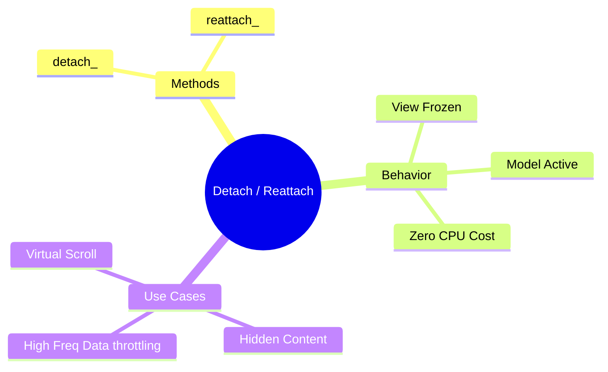

# 🧊 Use Case 5: Detach & Reattach

> **Goal**: The "Nuclear Option" for performance. Completely cut off a component from the Change Detection tree to handle massive data bursts or background processing.

---

## 1. 🔍 How It Works (The Concept)

### The Mechanism
Angular keeps a list of components to check.
*   **`detach()`**: Removes the component from this list. Angular forgets it exists. Data changes will **never** reflect in the UI.
*   **`reattach()`**: Adds it back to the list. Angular resumes checking it.

This is useful when you have a component that is computationally expensive and invisible (e.g., hidden in a collapsed tab) or changing too fast to render useful info.

### 🌳 Tree Surgery Diagram

```mermaid
graph TD
    Root[App Root]
    
    subgraph Tree [Component Tree]
        A[Parent]
        B[Header]
        C[Sidebar]
        
        List[🔥 Heavy List Component]
        
        Item1[Item 1]
        Item2[Item 2]
    end
    
    Root --> A
    A --> B
    A --> C
    A -.->|❌ Cut Connection (Detach)| List
    
    List --> Item1
    List --> Item2
    
    style List fill:#bdbdbd,stroke:#616161,stroke-dasharray: 5 5
    style Item1 fill:#bdbdbd,stroke:#616161
    style Item2 fill:#bdbdbd,stroke:#616161
    style A fill:#fff9c4,stroke:#fbc02d
```

---

## 2. 🚀 Step-by-Step Implementation Guide

### Step 1: Detach on Init or Demand
Calling `detach()` essentially freezes the view.

```typescript
// heavy-list.component.ts
export class HeavyListComponent {
  constructor(private cdr: ChangeDetectorRef) {}

  stopUpdates() {
    // 🛡️ CRITICAL: UI freezes instantly here.
    // Any changes to this.data will accumulate in memory but NOT on screen.
    this.cdr.detach(); 
  }

  resumeUpdates() {
    // 🛡️ CRITICAL: Re-connect to the tree.
    this.cdr.reattach();
    // Optional: force an immediate sync to show what happened while frozen
    this.cdr.detectChanges(); 
  }
}
```

### Step 2: Use Case (Debouncing UI)
Imagine a WebSocket pushing 100 messages/sec. Rendering 100 times/sec is wasteful.

```typescript
onMessage(msg) {
  this.buffer.push(msg); // Add data (fast)
  
  if (this.buffer.length % 100 === 0) {
     // Only render every 100th message
     this.cdr.detectChanges(); 
  }
}
```
Or detach completely and use a `setInterval` to running `detectChanges()` once per second (1fps) even if data comes in at 1000fps.

---

## 3. 🐛 Common Pitfalls & Debugging

### ❌ Pitfall 1: Forgetting to Reattach
**Scenario**: User switches tabs, you detach the hidden tab. User switches back.
**Result**: Tab is blank or stale.
**Fix**: Use `ngOnDestroy` (though component is destroyed anyway) or page visibility events to ensure you reattach when the component becomes visible again.

### ❌ Pitfall 2: Input Bindings Stop Working
**Scenario**: You detach a child. Parent changes an Input property.
**Result**: Child does not update. Detached means detached. Inputs are still set on the class instance, but `ngOnChanges` and view updates won't trigger standard lifecycle flows related to view sync.

---

## 4. ⚡ Performance & Architecture

### Performance
*   **Zero Cost**: A detached component costs **zero** CPU cycles during global Change Detection.
*   **Memory**: It still consumes memory (it exists in RAM), but it consumes no CPU for rendering.

### Architecture
*   **Virtual Scroll**: Many virtual scroll implementations use detach/reattach logic to manage rows that scroll out of view.
*   **Hidden Tabs**: If you have a complex dashboard in a hidden tab, detach it. Why check it if no one can see it?

---

## 5. 🌍 Real World Use Cases

1.  **High-Frequency Trading**: Price tickers updating milliseconds. Detach and update only 2-4 times a second using a local timer loop with `detectChanges`.
2.  **Accordion/Collapsible Sections**: When a section is `collapsed`, detach it. When `expanded`, reattach it. Massive performance gains for large lists.
3.  **Map/Canvas Overlays**: Complex HTML overlays on top of a WebGL map. Detach them while panning the map to keep FPS high.

---

## 6. 📝 The Analogy: "The Hibernation" 🐻

*   **Attached (Awake)**: The bear is awake. It eats, walks, and reacts to every sound in the forest. High energy usage.
*   **Detached (Hibernation)**: The bear goes into a cave and sleeps. It's still a bear (Instance exists), but it doesn't move, eat, or react to anything. It uses almost zero energy. When spring comes (Reattach), it wakes up and resumes life.

---

## 7. ❓ Interview & Concept Questions

1.  **Q: If I detach a component, can I still manually update it?**
    *   **A:** Yes! You can still call `detectChanges()` on a detached component to trigger a one-off update. Change Detection basically becomes "Opt-In" only.

2.  **Q: Does `detach` destroy the component?**
    *   **A:** No. `ngOnDestroy` is not called. The component instance and DOM elements remain alive, just static.

3.  **Q: How is this different from `*ngIf="false"`?**
    *   **A:** `*ngIf` removes the element from the DOM and destroys the component instance. `detach` keeps the DOM and instance, just stops updating it.

---

## 🧠 Mind Map


