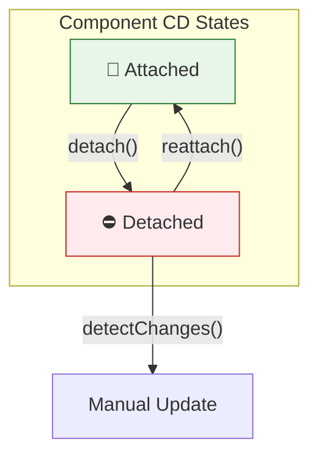
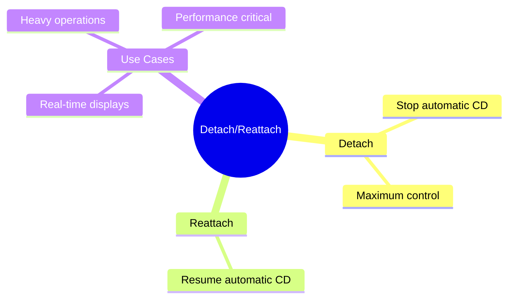

# 🔌 Use Case 5: Detach & Reattach

> **💡 Lightbulb Moment**: Detach components from change detection for maximum performance control!

---

## 1. 🔍 Detach Pattern

```typescript
@Component({
    template: `...`
})
export class HighPerformanceComponent implements OnInit {
    constructor(private cdr: ChangeDetectorRef) {}
    
    ngOnInit() {
        this.cdr.detach();  // Stop automatic CD
    }
    
    onRefresh() {
        this.cdr.detectChanges();  // Manual update
    }
}
```

---

## 2. 🚀 Use Cases

### Real-time data display (only show latest)
```typescript
ngOnInit() {
    this.cdr.detach();
    
    setInterval(() => {
        this.fetchLatestData();
        this.cdr.detectChanges();
    }, 5000);
}
```

### Expensive rendering
```typescript
// Detach during heavy operation
this.cdr.detach();
this.heavyOperation();
this.cdr.reattach();
this.cdr.detectChanges();
```

### 📊 Data Flow Diagram



### 📦 Data Flow Summary (Visual Box Diagram)

```
┌─────────────────────────────────────────────────────────────┐
│  DETACH / REATTACH PATTERN                                  │
│                                                             │
│   NORMAL STATE (Attached):                                  │
│   ┌───────────────────────────────────────────────────────┐ │
│   │  🔌 Component participates in Change Detection        │ │
│   │                                                       │ │
│   │  Angular CD Cycle → Checks this component → Updates   │ │
│   │                                                       │ │
│   │  Every user event, timer, HTTP → component checked    │ │
│   └───────────────────────────────────────────────────────┘ │
│                       │                                     │
│      this.cdr.detach(); // "Unplug from CD"                 │
│                       │                                     │
│                       ▼                                     │
│   DETACHED STATE:                                           │
│   ┌───────────────────────────────────────────────────────┐ │
│   │  ⛔ Component COMPLETELY IGNORED by CD                │ │
│   │                                                       │ │
│   │  • User clicks?     → Component NOT checked           │ │
│   │  • Timer fires?     → Component NOT checked           │ │
│   │  • HTTP returns?    → Component NOT checked           │ │
│   │                                                       │ │
│   │  View is FROZEN - won't update automatically!         │ │
│   └───────────────────────────────────────────────────────┘ │
│                       │                                     │
│      Two ways to update:                                    │
│                       │                                     │
│         ┌─────────────┴─────────────┐                       │
│         ▼                           ▼                       │
│   ┌──────────────┐          ┌──────────────┐                │
│   │detectChanges │          │  reattach()  │                │
│   │   ()         │          │              │                │
│   │              │          │ + Resume     │                │
│   │ Manual one-  │          │   automatic  │                │
│   │ time update  │          │   CD         │                │
│   └──────────────┘          └──────────────┘                │
│                                                             │
│   USE CASE: Real-time Dashboard                             │
│   ┌───────────────────────────────────────────────────────┐ │
│   │ ngOnInit() {                                          │ │
│   │   this.cdr.detach();  // Stop automatic updates       │ │
│   │                                                       │ │
│   │   setInterval(() => {                                 │ │
│   │     this.fetchData();                                 │ │
│   │     this.cdr.detectChanges();  // Update every 5s     │ │
│   │   }, 5000);                                           │ │
│   │ }                                                     │ │
│   └───────────────────────────────────────────────────────┘ │
└─────────────────────────────────────────────────────────────┘
```

**Detach Pattern Decision:**
| Scenario | Strategy |
|----------|----------|
| Real-time data (show latest) | Detach + periodic detectChanges |
| Heavy computation running | Detach during, reattach after |
| Rarely updating component | Detach + detectChanges on demand |

> **Key Takeaway**: `detach()` gives you FULL control - but with great power comes great responsibility. Component won't update until YOU tell it to!

---

## 3. ❓ Interview Questions

### Basic Questions

#### Q1: When would you detach a component?
**Answer:**
- High-frequency data updates (show only latest)
- Heavy computations
- Components not needing live updates
- Performance optimization

#### Q2: Risks of detach?
**Answer:**
- View won't update automatically
- Easy to forget to reattach
- May confuse maintenance
- Use sparingly

---

## 🧠 Mind Map


