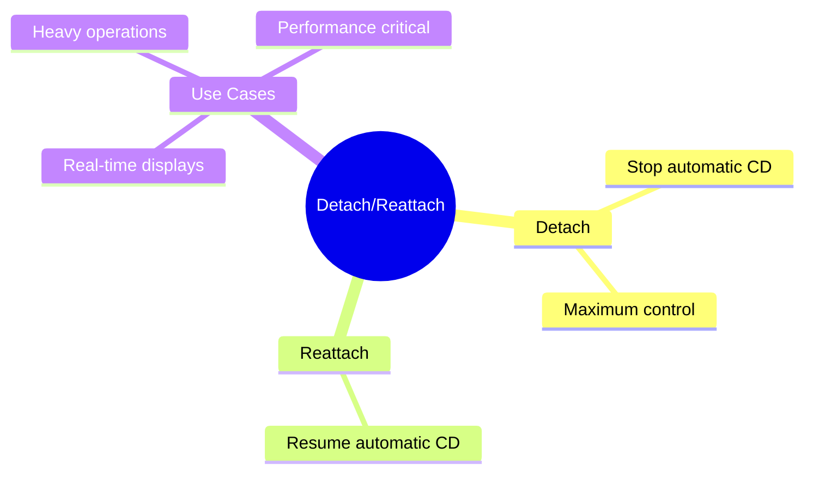

# 🔌 Use Case 5: Detach & Reattach

> **💡 Lightbulb Moment**: Detach components from change detection for maximum performance control!

---

## 1. 🔍 Detach Pattern

```typescript
@Component({
    template: `...`
})
export class HighPerformanceComponent implements OnInit {
    constructor(private cdr: ChangeDetectorRef) {}
    
    ngOnInit() {
        this.cdr.detach();  // Stop automatic CD
    }
    
    onRefresh() {
        this.cdr.detectChanges();  // Manual update
    }
}
```

---

## 2. 🚀 Use Cases

### Real-time data display (only show latest)
```typescript
ngOnInit() {
    this.cdr.detach();
    
    setInterval(() => {
        this.fetchLatestData();
        this.cdr.detectChanges();
    }, 5000);
}
```

### Expensive rendering
```typescript
// Detach during heavy operation
this.cdr.detach();
this.heavyOperation();
this.cdr.reattach();
this.cdr.detectChanges();
```

---

## 3. ❓ Interview Questions

### Basic Questions

#### Q1: When would you detach a component?
**Answer:**
- High-frequency data updates (show only latest)
- Heavy computations
- Components not needing live updates
- Performance optimization

#### Q2: Risks of detach?
**Answer:**
- View won't update automatically
- Easy to forget to reattach
- May confuse maintenance
- Use sparingly

---

## 🧠 Mind Map


