# 🔌 Use Case 5: Detach & Reattach

> **💡 Lightbulb Moment**: Detach components from change detection for maximum performance control!


---

## 1. 🔍 Detach Pattern

```typescript
@Component({
    template: `...`
})
export class HighPerformanceComponent implements OnInit {
    constructor(private cdr: ChangeDetectorRef) {}
    
    ngOnInit() {
        this.cdr.detach();  // Stop automatic CD
    }
    
    onRefresh() {
        this.cdr.detectChanges();  // Manual update
    }
}
```

---

## 2. 🚀 Use Cases

### Real-time data display (only show latest)
```typescript
ngOnInit() {
    this.cdr.detach();
    
    setInterval(() => {
        this.fetchLatestData();
        this.cdr.detectChanges();
    }, 5000);
}
```

### Expensive rendering
```typescript
// Detach during heavy operation
this.cdr.detach();
this.heavyOperation();
this.cdr.reattach();
this.cdr.detectChanges();
```

### 📊 Data Flow Diagram

```mermaid
flowchart TD
    subgraph States["Component CD States"]
        Attached["🔌 Attached"]
        Detached["⛔ Detached"]
    end
    
    Attached -->|"detach()"| Detached
    Detached -->|"reattach()"| Attached
    Detached -->|"detectChanges()"| Manual["Manual Update"]
    
    style Detached fill:#ffebee,stroke:#c62828
    style Attached fill:#e8f5e9,stroke:#2e7d32
```



### 📦 Data Flow Summary (Visual Box Diagram)

```
┌─────────────────────────────────────────────────────────────┐
│  DETACH / REATTACH PATTERN                                  │
│                                                             │
│   NORMAL STATE (Attached):                                  │
│   ┌───────────────────────────────────────────────────────┐ │
│   │  🔌 Component participates in Change Detection        │ │
│   │                                                       │ │
│   │  Angular CD Cycle → Checks this component → Updates   │ │
│   │                                                       │ │
│   │  Every user event, timer, HTTP → component checked    │ │
│   └───────────────────────────────────────────────────────┘ │
│                       │                                     │
│      this.cdr.detach(); // "Unplug from CD"                 │
│                       │                                     │
│                       ▼                                     │
│   DETACHED STATE:                                           │
│   ┌───────────────────────────────────────────────────────┐ │
│   │  ⛔ Component COMPLETELY IGNORED by CD                │ │
│   │                                                       │ │
│   │  • User clicks?     → Component NOT checked           │ │
│   │  • Timer fires?     → Component NOT checked           │ │
│   │  • HTTP returns?    → Component NOT checked           │ │
│   │                                                       │ │
│   │  View is FROZEN - won't update automatically!         │ │
│   └───────────────────────────────────────────────────────┘ │
│                       │                                     │
│      Two ways to update:                                    │
│                       │                                     │
│         ┌─────────────┴─────────────┐                       │
│         ▼                           ▼                       │
│   ┌──────────────┐          ┌──────────────┐                │
│   │detectChanges │          │  reattach()  │                │
│   │   ()         │          │              │                │
│   │              │          │ + Resume     │                │
│   │ Manual one-  │          │   automatic  │                │
│   │ time update  │          │   CD         │                │
│   └──────────────┘          └──────────────┘                │
│                                                             │
│   USE CASE: Real-time Dashboard                             │
│   ┌───────────────────────────────────────────────────────┐ │
│   │ ngOnInit() {                                          │ │
│   │   this.cdr.detach();  // Stop automatic updates       │ │
│   │                                                       │ │
│   │   setInterval(() => {                                 │ │
│   │     this.fetchData();                                 │ │
│   │     this.cdr.detectChanges();  // Update every 5s     │ │
│   │   }, 5000);                                           │ │
│   │ }                                                     │ │
│   └───────────────────────────────────────────────────────┘ │
└─────────────────────────────────────────────────────────────┘
```

**Detach Pattern Decision:**
| Scenario | Strategy |
|----------|----------|
| Real-time data (show latest) | Detach + periodic detectChanges |
| Heavy computation running | Detach during, reattach after |
| Rarely updating component | Detach + detectChanges on demand |

> **Key Takeaway**: `detach()` gives you FULL control - but with great power comes great responsibility. Component won't update until YOU tell it to!

---

---

## 🎯 What Problem Does This Solve?

### The Problem: Change Detection Overkill
**Scenario:**
You have a component that only updates once every 5 minutes (like a "Stock Ticker" sidebar), but it sits inside an app that updates 60 times a second (animation elsewhere).
Every time the animation triggers CD, your Stock Ticker is also checked, wasting CPU.

**Problems:**
1.  **CPU Waste**: Checking static components repeatedly.
2.  **Battery Drain**: Mobile devices hate constant processing.
3.  **Visual Glitches**: Sometimes you *want* a component to freeze (e.g., stopping a log stream to read it).

### How Detach Solves This
**With Detach:**
```typescript
constructor(cdr: ChangeDetectorRef) {
    cdr.detach(); // Angular: "I'll pretend this component doesn't exist."
}
```

| Problem | Solution |
|---------|----------|
| Wasted Checks | **Pruning**: Effectively removes the component (and its children) from the CD tree. |
| Freezing UI | **Pause/Resume**: You can stop updates (detach) and resume them (reattach) at will. |

---

## 📚 Key Classes & Types Explained

### 1. `detach()`
*   **Result**: The view is removed from the change detection tree.
*   **Consequence**: Data bindings in the template will **NOT** update, even if the typescript variables change. Inputs will technically update on the class instance, but `ngOnChanges` might not fire (depends on setup surrounding it) and view remains stale.

### 2. `reattach()`
*   **Result**: The view is inserted back into the CD tree.
*   **Consequence**: It will start being checked automatically again in future cycles.

---

## 🌍 Real-World Use Cases

### 1. Heavy Data Charts
A chart takes 50ms to render. You don't want to re-render it every time the user types in an unrelated input field.
**Strategy**: Detach on Init. Only call `detectChanges()` when the Chart Data Input specifically changes.

### 2. "Live" Logs Scroll
Console log viewer.
**Strategy**: When user scrolls up to read "History", call `detach()` so new logs don't shift the view. When user scrolls to bottom, `reattach()` to resume auto-scrolling.

### 3. Infinite Scroll Lists
As you render row 1000-1010, rows 0-900 are off-screen.
**Strategy**: `detach()` the off-screen rows. They exist in DOM (for scroll height) but consume 0 CD cycles.

### 4. Background Tabs
In a Tabbed interface, detach the components in the hidden tabs. Reattach them only when the user clicks the tab.

---

## ❓ Complete Interview Questions (20+)

### Basic Questions

**Q1: What does `detach()` actually do?**
> A: Removes the view from the Change Detection tree. Angular acts as if the component isn't there during traversal.

**Q2: Will `@Input()` changes update the view if detached?**
> A: No. The class property will change, but the template won't reflect it until you `detectChanges`.

**Q3: Does `detach` destroy the component?**
> A: No! The component is alive, the DOM is there. It's just "asleep" for CD purposes.

**Q4: Can I check a detached component?**
> A: Yes, by calling `detectChanges()` manually on it. "I know you're sleeping, but update ONCE right now."

**Q5: What happens to children of a detached component?**
> A: They are also detached effectively, because the check traversal stops at the parent.

---

### Scenario-Based Questions

**Q6: Scenario: Optimization for a large list.**
> A: Detach rows that are not in the viewport.

**Q7: Scenario: Pausing a stream.**
> A: User clicks "Pause". Call `cdr.detach()`. User clicks "Resume". Call `cdr.reattach()`.

**Q8: Scenario: 3rd party grid is slow.**
> A: Wrap it in a component that detaches itself, and only `detectChanges` when your data source emits.

**Q9: Scenario: "ExpressionChanged" warning in detached component?**
> A: Can still happen if you manually `detectChanges` at the wrong time (e.g., during parent's check).

**Q10: Scenario: Memory Leaks?**
> A: `detach` itself doesn't cause leaks, but if you detach and forget references, you might think it's gone when it's not.

---

### Advanced Questions

**Q11: `detach` vs `OnPush`?**
> A: `OnPush` is "Check me rarely" (automatic). `detach` is "Check me NEVER" (manual).

**Q12: Can I use `async` pipe with detached component?**
> A: Yes, BUT the `async` pipe calls `markForCheck()`. Since the component is detached, `markForCheck` might be ignored or meaningless because the traversal is broken. You usually need `detectChanges`.

**Q13: Does `ngZone.runOutsideAngular` detach?**
> A: No. That prevents the *trigger*. `detach` prevents the *response*.

**Q14: How to verify a component is detached?**
> A: Hard to inspect programmatically (internal state). Behaviorally, modify a public variable and see if view updates.

**Q15: Does `detach` affect lifecycle hooks?**
> A: `ngOnChanges` might stop if parent stops pushing inputs. `ngDoCheck` still runs! (Surprisingly).

**Q16: Can I reattach in a different place?**
> A: No, `reattach` puts it back where it was.

**Q17: Is `detach` persistent across routes?**
> A: No, component destruction destroys the CDR.

**Q18: Impact on dependency injection?**
> A: None.

**Q19: Can I use `detach` in a pipe?**
> A: No, CDR is for Views (Components/Directives).

**Q20: Why not use `detach` everywhere?**
> A: Management overhead. You effectively switch to Manual Change Detection, which is hard to maintain and bug-prone (stale UI).

## 🧠 Mind Map


