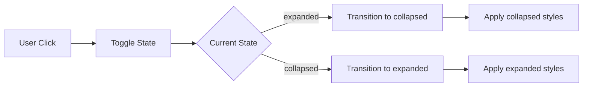
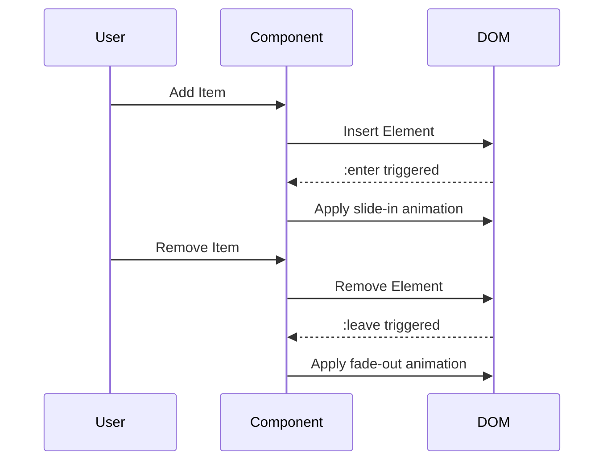

# 🎬 Animations Practice Exercises

## Overview
Master Angular animations including state transitions, enter/leave animations, keyframes, stagger effects, and complex multi-step sequences.

---

## 📚 Basic Exercises (4)

### Exercise 1: State Transition Animation
**Objective**: Create a component that demonstrates basic state animations using `trigger`, `state`, `style`, and `transition`.

#### Problem Statement
Build a toggle button that animates a panel between "expanded" and "collapsed" states with smooth height and opacity transitions.

#### Requirements
- Create two states: `expanded` and `collapsed`
- Animate height from 0 to 200px
- Animate opacity from 0 to 1
- Use 300ms ease-in-out timing

#### Solution Flow


#### Key Concepts
```typescript
@Component({
  animations: [
    trigger('expandCollapse', [
      state('collapsed', style({ height: '0px', opacity: 0 })),
      state('expanded', style({ height: '200px', opacity: 1 })),
      transition('collapsed <=> expanded', animate('300ms ease-in-out'))
    ])
  ]
})
```

---

### Exercise 2: Enter/Leave Animations
**Objective**: Implement void state animations for elements entering and leaving the DOM.

#### Problem Statement
Create a todo list where items animate in when added and animate out when removed.

#### Requirements
- Use `:enter` alias for `void => *` transition
- Use `:leave` alias for `* => void` transition
- Items should slide in from the left
- Items should fade out when removed

#### Solution Flow


---

### Exercise 3: Keyframe Animations
**Objective**: Create multi-step animations using keyframes for complex motion paths.

#### Problem Statement
Build a loading spinner that uses keyframes to create a pulsing effect with color changes.

#### Requirements
- Use `keyframes()` function
- Create at least 3 animation steps
- Animate both size and color
- Loop the animation

#### Key Concepts
```typescript
transition(':enter', [
  animate('1000ms', keyframes([
    style({ transform: 'scale(0)', backgroundColor: 'red', offset: 0 }),
    style({ transform: 'scale(1.2)', backgroundColor: 'yellow', offset: 0.5 }),
    style({ transform: 'scale(1)', backgroundColor: 'green', offset: 1 })
  ]))
])
```

---

### Exercise 4: Animation Callbacks
**Objective**: Handle animation start and done events for coordinating complex UI updates.

#### Problem Statement
Create a component that shows a progress indicator during animation and updates UI state after animation completion.

#### Requirements
- Use `(@trigger.start)` callback
- Use `(@trigger.done)` callback
- Display animation phase information
- Disable buttons during animation

---

## 🎯 Complex Scenarios (5)

### Scenario 1: Stagger Animations
**Objective**: Animate multiple elements with a staggered delay for list rendering.

#### Use Case
E-commerce product grid that animates products in with a stagger effect on page load.

#### Implementation
```typescript
trigger('stagger', [
  transition(':enter', [
    query(':enter', [
      style({ opacity: 0, transform: 'translateY(20px)' }),
      stagger('50ms', [
        animate('300ms ease-out', style({ opacity: 1, transform: 'translateY(0)' }))
      ])
    ], { optional: true })
  ])
])
```

---

### Scenario 2: Route Animations
**Objective**: Implement page transition animations when navigating between routes.

#### Use Case
Single-page application with smooth slide transitions between views.

#### Requirements
- Animate route changes
- Support both forward and backward navigation
- Maintain smooth performance

---

### Scenario 3: Animation Groups
**Objective**: Run multiple animations in parallel using `group()`.

#### Use Case
Card flip animation that simultaneously rotates and changes opacity.

---

### Scenario 4: Dynamic Animation Parameters
**Objective**: Pass runtime values to animations using animation params.

#### Use Case
Customizable notification toast with configurable duration and position.

---

### Scenario 5: Complex Sequence Orchestration
**Objective**: Chain multiple animations using `sequence()` for ordered execution.

#### Use Case
Multi-step onboarding wizard with coordinated element animations.

---

## 🔑 Key Takeaways

1. **States**: Define discrete visual configurations
2. **Transitions**: Define how to animate between states
3. **Timing**: Control duration, delay, and easing
4. **Keyframes**: Multi-step animations within a single transition
5. **Stagger**: Delay animations for list items
6. **Callbacks**: Respond to animation events
7. **Performance**: Use `transform` and `opacity` for smooth 60fps animations

## 📖 Resources
- [Angular Animations Guide](https://angular.io/guide/animations)
- [Animation Triggers](https://angular.io/api/animations/trigger)
- [Web Animations API](https://developer.mozilla.org/en-US/docs/Web/API/Web_Animations_API)
