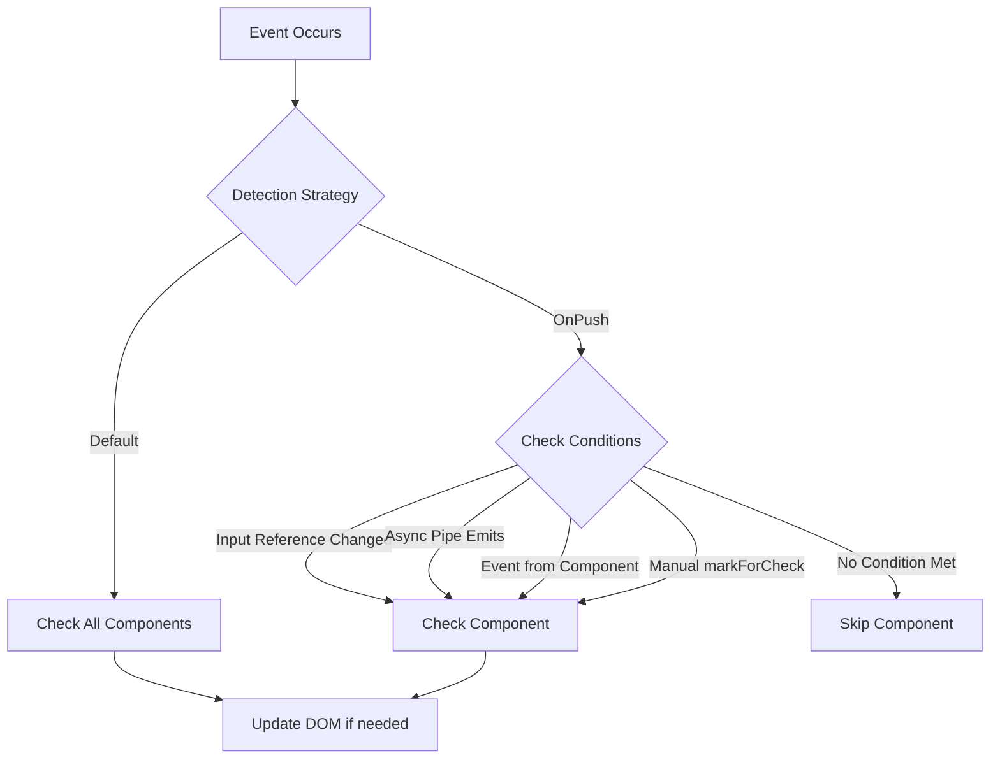
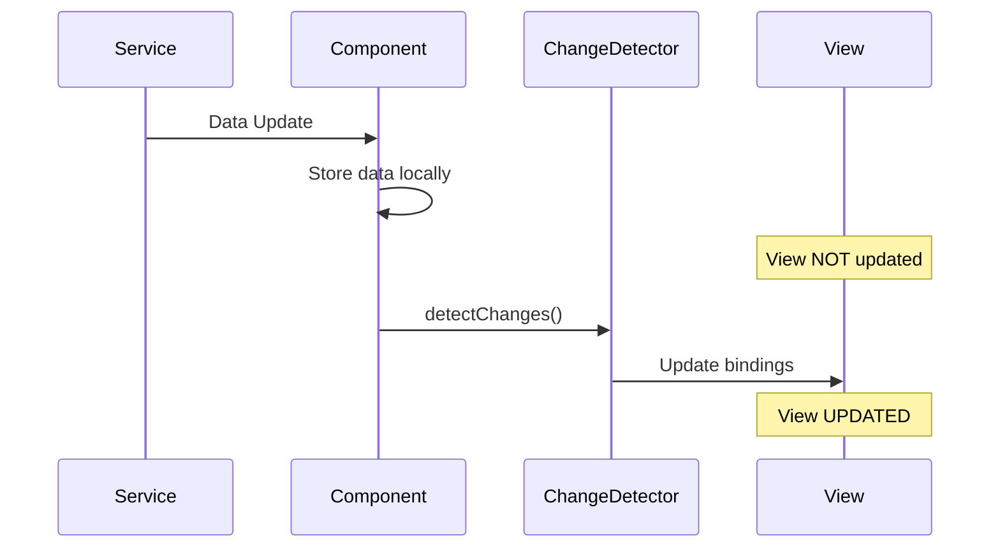
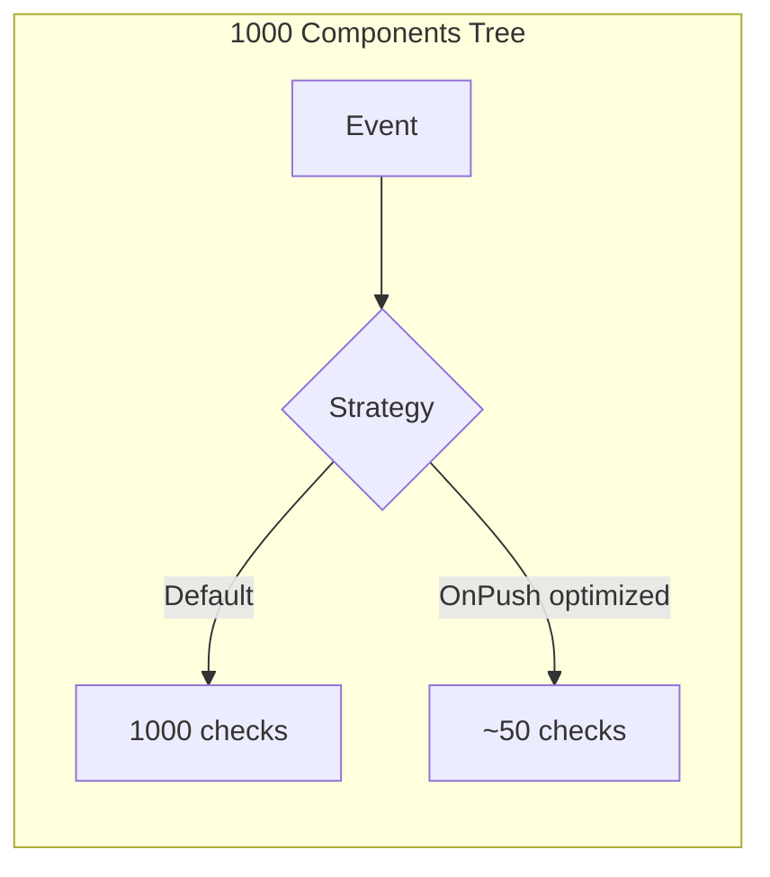

# 🔬 Change Detection Practice Exercises

## Overview
Master Angular's change detection mechanism including OnPush strategy, manual detection, Zone.js integration, and performance optimization techniques.

---

## 📚 Basic Exercises (4)

### Exercise 1: Default vs OnPush Strategy
**Objective**: Understand the difference between Default and OnPush change detection strategies.

#### Problem Statement
Create two components side-by-side: one using Default strategy and one using OnPush. Demonstrate when each triggers change detection.

#### Requirements
- Component with Default strategy
- Component with OnPush strategy
- Counter showing CD trigger count
- Button to trigger various types of updates

#### Change Detection Flow


#### Key Concepts
```typescript
@Component({
  changeDetection: ChangeDetectionStrategy.OnPush
})
export class OnPushComponent {
  // Only checked when:
  // 1. @Input() reference changes
  // 2. Event originates from this component
  // 3. Async pipe emits
  // 4. Manually triggered
}
```

---

### Exercise 2: Manual Change Detection
**Objective**: Learn to use ChangeDetectorRef for manual detection control.

#### Problem Statement
Build a component that receives data updates from a service but only refreshes the view when explicitly triggered.

#### Methods to Learn
- `detectChanges()` - Run CD on this component and children
- `markForCheck()` - Mark component path for next CD cycle
- `detach()` - Detach from CD tree
- `reattach()` - Reattach to CD tree

#### Solution Flow


---

### Exercise 3: Zone.js and runOutsideAngular
**Objective**: Execute expensive operations outside Angular's zone to prevent unnecessary change detection.

#### Problem Statement
Create a component with a high-frequency timer (every 100ms) that doesn't trigger change detection on every tick.

#### Requirements
- Timer running every 100ms
- Timer runs outside Angular zone
- Manual update only when needed
- Compare performance with in-zone timer

#### Key Concepts
```typescript
constructor(private ngZone: NgZone) {
  this.ngZone.runOutsideAngular(() => {
    setInterval(() => {
      // This won't trigger CD
      this.counter++;
      
      if (this.counter % 10 === 0) {
        this.ngZone.run(() => {
          // This WILL trigger CD
          this.updateView();
        });
      }
    }, 100);
  });
}
```

---

### Exercise 4: Immutability Pattern
**Objective**: Understand why OnPush requires immutable data patterns.

#### Problem Statement
Demonstrate the difference between mutating an array/object vs creating a new reference, and how it affects OnPush components.

#### Comparison
```mermaid
graph LR
    subgraph "❌ Mutation - OnPush won't detect"
        A[array.push item] --> B[Same Reference]
        B --> C[No CD Triggered]
    end
    
    subgraph "✅ Immutable - OnPush will detect"
        D[array = [...array, item]] --> E[New Reference]
        E --> F[CD Triggered]
    end
```

---

## 🎯 Complex Scenarios (5)

### Scenario 1: Real-time Dashboard
**Objective**: Build a dashboard receiving WebSocket updates with optimized change detection.

#### Use Case
Stock price ticker displaying 100+ stocks with updates every second.

#### Optimization Techniques
- OnPush strategy
- Virtual scrolling
- Selective updates with trackBy
- Batched change detection

---

### Scenario 2: Large Form with Partial Updates
**Objective**: Optimize a complex form where only some fields update frequently.

#### Use Case
Order form with live pricing calculations, inventory checks, and shipping estimates.

---

### Scenario 3: Observable-driven OnPush
**Objective**: Leverage async pipe for automatic change detection with OnPush.

#### Use Case
Chat application where messages stream in via observable.

#### Pattern
```typescript
@Component({
  changeDetection: ChangeDetectionStrategy.OnPush,
  template: `
    <div *ngFor="let msg of messages$ | async">
      {{ msg.content }}
    </div>
  `
})
export class ChatComponent {
  messages$ = this.chatService.messages$;
}
```

---

### Scenario 4: Detach/Reattach Pattern
**Objective**: Implement detach pattern for components that update on-demand.

#### Use Case
Data grid with thousands of rows that only updates on user refresh.

---

### Scenario 5: Zone.js-free Component
**Objective**: Build a fully zoneless component for maximum performance.

#### Use Case
Animation-heavy game component that manages its own render loop.

---

## 🔑 Key Takeaways

1. **Default Strategy**: Checks entire component tree on every event
2. **OnPush Strategy**: Only checks when specific conditions are met
3. **Immutability**: Essential for OnPush to work correctly
4. **Zone.js**: Monkey-patches async APIs to trigger CD
5. **ngZone**: Provides control over zone execution
6. **ChangeDetectorRef**: Manual control over detection
7. **Performance**: OnPush can dramatically reduce CD cycles

## 📊 Performance Comparison


## 📖 Resources
- [Change Detection Guide](https://angular.io/guide/change-detection)
- [OnPush Strategy](https://angular.io/api/core/ChangeDetectionStrategy)
- [Zone.js](https://github.com/angular/angular/tree/main/packages/zone.js)
