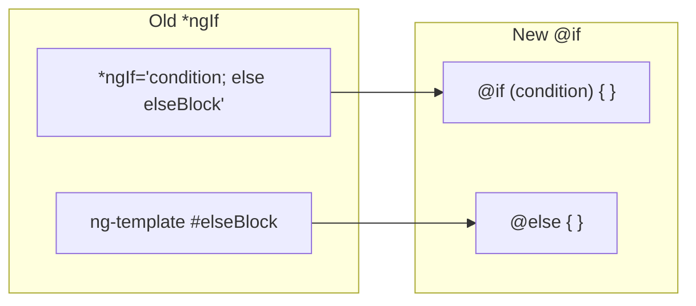
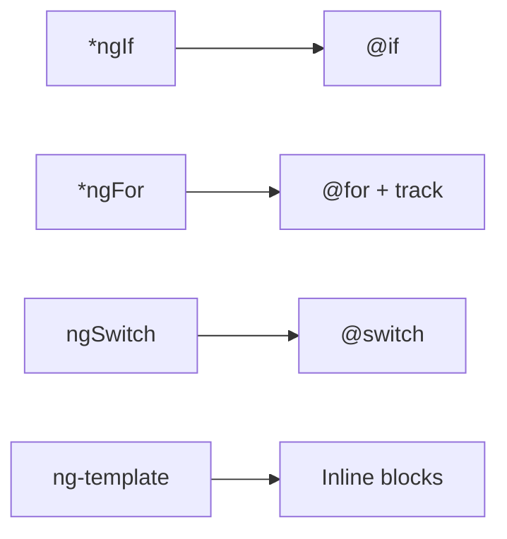

# 🔀 Control Flow Practice Exercises

## Overview
Master Angular 17+ built-in control flow syntax including `@if`, `@for`, `@switch`, `@empty`, and `@defer` for cleaner, more performant templates.

---

## 📚 Basic Exercises (4)

### Exercise 1: @if/@else Conditional Rendering
**Objective**: Replace *ngIf with the new @if syntax for cleaner conditionals.

#### Problem Statement
Build a user profile component that shows different content based on authentication state and user role.

#### Syntax Comparison


#### Key Concepts
```html
<!-- New @if syntax -->
@if (user.isLoggedIn) {
  <h1>Welcome, {{ user.name }}!</h1>
  @if (user.isAdmin) {
    <admin-panel />
  }
} @else if (user.isPending) {
  <pending-message />
} @else {
  <login-form />
}
```

#### Benefits
- No need for ng-template
- Natural else-if chains
- Better readability
- Type narrowing in subsequent blocks

---

### Exercise 2: @for Loop Iteration
**Objective**: Use @for for iterating over collections with built-in track function.

#### Problem Statement
Create a product list component that displays products with proper tracking for efficient DOM updates.

#### Requirements
- Use @for with track expression
- Implement @empty for no-data state
- Access loop variables ($index, $first, $last, $even, $odd)
- Compare with *ngFor performance

#### Syntax
```html
@for (product of products; track product.id) {
  <product-card 
    [product]="product"
    [isFirst]="$first"
    [isLast]="$last"
  />
} @empty {
  <no-products-message />
}
```

#### Available Variables
```mermaid
graph TD
    A[@for loop] --> B[$index: number]
    A --> C[$first: boolean]
    A --> D[$last: boolean]
    A --> E[$even: boolean]
    A --> F[$odd: boolean]
    A --> G[$count: number]
```

---

### Exercise 3: @switch Multi-case Branching
**Objective**: Implement @switch for cleaner multi-case conditional rendering.

#### Problem Statement
Build a notification component that renders different templates based on notification type.

#### Requirements
- Handle multiple notification types (success, error, warning, info)
- Provide @default case
- Compare with ngSwitch directive

#### Syntax
```html
@switch (notification.type) {
  @case ('success') {
    <success-notification [data]="notification" />
  }
  @case ('error') {
    <error-notification [data]="notification" />
  }
  @case ('warning') {
    <warning-notification [data]="notification" />
  }
  @default {
    <info-notification [data]="notification" />
  }
}
```

---

### Exercise 4: Combining Control Flow
**Objective**: Combine multiple control flow blocks for complex UI logic.

#### Problem Statement
Create a dashboard that combines @if, @for, and @switch to render a dynamic data grid.

#### Pattern
```html
@if (isLoading) {
  <loading-spinner />
} @else if (hasError) {
  <error-message />
} @else {
  @for (item of items; track item.id) {
    @switch (item.status) {
      @case ('active') { <active-row [item]="item" /> }
      @case ('pending') { <pending-row [item]="item" /> }
      @default { <default-row [item]="item" /> }
    }
  } @empty {
    <empty-table-message />
  }
}
```

---

## 🎯 Complex Scenarios (5)

### Scenario 1: Virtual Scrolling with @for
**Objective**: Combine @for with virtual scrolling for large lists.

#### Use Case
Email inbox with thousands of messages, efficiently rendered with virtual scroll.

#### Implementation
```typescript
@Component({
  template: `
    <cdk-virtual-scroll-viewport itemSize="50">
      @for (email of emails; track email.id) {
        <email-row [email]="email" />
      }
    </cdk-virtual-scroll-viewport>
  `
})
```

---

### Scenario 2: Nested Control Flow
**Objective**: Handle complex nested data structures with nested control flow.

#### Use Case
Organization chart with departments, teams, and members.

```html
@for (dept of departments; track dept.id) {
  <department-header [dept]="dept" />
  @for (team of dept.teams; track team.id) {
    <team-section [team]="team">
      @for (member of team.members; track member.id) {
        <member-card [member]="member" />
      } @empty {
        <span>No members</span>
      }
    </team-section>
  }
}
```

---

### Scenario 3: Dynamic Form with Control Flow
**Objective**: Build a dynamic form that changes based on user selections.

#### Use Case
Insurance quote form that shows different questions based on coverage type.

---

### Scenario 4: Wizard/Stepper Pattern
**Objective**: Implement a multi-step wizard using @switch.

#### Use Case
Account setup wizard with different step components.

```html
@switch (currentStep) {
  @case (1) { <personal-info-step /> }
  @case (2) { <address-step /> }
  @case (3) { <payment-step /> }
  @case (4) { <review-step /> }
}
```

---

### Scenario 5: Feature Flags with @if
**Objective**: Implement feature flag-based rendering.

#### Use Case
Application with features enabled/disabled based on user permissions or A/B testing.

```html
@if (featureFlags.newDashboard()) {
  <new-dashboard />
} @else {
  <legacy-dashboard />
}
```

---

## 🔑 Key Takeaways

1. **Cleaner Syntax**: No more ng-template references
2. **Type Narrowing**: TypeScript understands conversions
3. **Required Track**: @for requires track expression (better performance)
4. **Built-in Variables**: Access loop context variables directly
5. **@empty Block**: Handle empty collections elegantly
6. **Migration**: Use ng update for automatic migration

## 📊 Migration Guide


## 📖 Resources
- [Built-in Control Flow](https://angular.io/guide/control_flow)
- [Migration Guide](https://angular.io/guide/control-flow-migration)
- [Angular 17 Release Notes](https://blog.angular.io/)
