# Solution: Attribute Directive

## 📊 Flow Diagram

```mermaid
flowchart TD
    subgraph Directive["🎨 Highlight Directive"]
        A[Element with appHighlight] --> B[Mouse Enter]
        B --> C[Store Original Color]
        C --> D[Apply Highlight Color]
        D --> E[Mouse Leave]
        E --> F[Restore Original Color]
    end

    style D fill:#fef3c7
    style F fill:#dcfce7
```



## 💻 Implementation

```typescript
import { Directive, ElementRef, HostListener, Input } from '@angular/core';

@Directive({
  selector: '[appHighlight]',
  standalone: true
})
export class HighlightDirective {
  @Input() appHighlight = 'yellow'; // Default color
  @Input() defaultColor = '';
  
  private originalColor = '';
  
  constructor(private el: ElementRef) {}
  
  @HostListener('mouseenter')
  onMouseEnter(): void {
    this.originalColor = this.el.nativeElement.style.backgroundColor;
    this.highlight(this.appHighlight);
  }
  
  @HostListener('mouseleave')
  onMouseLeave(): void {
    this.highlight(this.originalColor || this.defaultColor);
  }
  
  private highlight(color: string): void {
    this.el.nativeElement.style.backgroundColor = color;
  }
}
```

### Usage

```html
<p appHighlight>Highlights yellow on hover</p>
<p [appHighlight]="'lightblue'">Highlights blue on hover</p>
<p [appHighlight]="'pink'" defaultColor="white">Pink highlight, white default</p>
```

## 🔑 Key Concepts

- **@Directive**: Defines a directive class
- **@HostListener**: Listens to host element events
- **@Input**: Receives data from parent
- **ElementRef**: Direct access to DOM element
