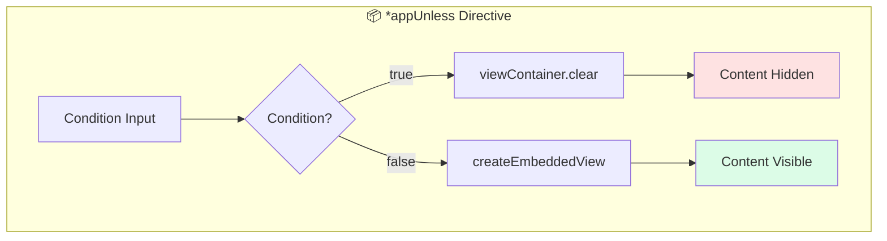

# Solution: Structural Directive

## 📊 Flow Diagram



## 💻 Implementation

```typescript
import { Directive, Input, TemplateRef, ViewContainerRef } from '@angular/core';

@Directive({
  selector: '[appUnless]',
  standalone: true
})
export class UnlessDirective {
  private hasView = false;

  constructor(
    private templateRef: TemplateRef<any>,
    private viewContainer: ViewContainerRef
  ) {}

  @Input() set appUnless(condition: boolean) {
    if (!condition && !this.hasView) {
      // Condition is FALSE, show the content
      this.viewContainer.createEmbeddedView(this.templateRef);
      this.hasView = true;
    } else if (condition && this.hasView) {
      // Condition is TRUE, hide the content
      this.viewContainer.clear();
      this.hasView = false;
    }
  }
}
```

### Usage

```html
<div *appUnless="isLoading">
  Content shows when NOT loading
</div>

<div *appUnless="hasPermission">
  Access Denied message (shows when no permission)
</div>
```

## 🔑 Key Concepts

- **TemplateRef**: Reference to the template content
- **ViewContainerRef**: Container that can hold views
- **createEmbeddedView**: Instantiates the template
- **clear**: Removes all views from container
