# Solution: Authentication Guard

## 🧠 Approach

The authentication guard follows a simple decision flow:
1. Check if the user is authenticated via `AuthService`
2. If authenticated, allow navigation
3. If not, capture the intended URL and redirect to login

## 📊 Flow Diagram

```mermaid
flowchart TD
    subgraph Guard["🛡️ Auth Guard"]
        A[Navigation Request] --> B{User Logged In?}
        B -->|Yes| C[✅ Allow Navigation]
        B -->|No| D[Capture Target URL]
        D --> E[Create Login UrlTree]
        E --> F[🔄 Redirect to /login]
    end
    
    subgraph Login["📝 Login Page"]
        F --> G[User Logs In]
        G --> H[Read returnUrl]
        H --> I[Navigate to Original URL]
    end

    style A fill:#e0f2fe
    style C fill:#dcfce7
    style F fill:#fef3c7
```



## 📊 Sequence Diagram


## 💻 Implementation

### Step 1: Create the Auth Service

```typescript
import { Injectable, signal } from '@angular/core';

@Injectable({ providedIn: 'root' })
export class AuthService {
  private loggedIn = signal(false);
  
  isLoggedIn(): boolean {
    return this.loggedIn();
  }
  
  login(username: string, password: string): boolean {
    // In real app, call API
    if (username && password) {
      this.loggedIn.set(true);
      return true;
    }
    return false;
  }
  
  logout(): void {
    this.loggedIn.set(false);
  }
}
```

### Step 2: Create the Functional Guard

```typescript
import { inject } from '@angular/core';
import { CanActivateFn, Router } from '@angular/router';
import { AuthService } from './auth.service';

export const authGuard: CanActivateFn = (route, state) => {
  const authService = inject(AuthService);
  const router = inject(Router);
  
  if (authService.isLoggedIn()) {
    return true;
  }
  
  // Redirect to login with return URL
  return router.createUrlTree(['/login'], {
    queryParams: { returnUrl: state.url }
  });
};
```

### Step 3: Apply to Routes

```typescript
export const routes: Routes = [
  { path: 'login', component: LoginComponent },
  { 
    path: 'dashboard', 
    component: DashboardComponent,
    canActivate: [authGuard]
  },
  { 
    path: 'profile', 
    component: ProfileComponent,
    canActivate: [authGuard]
  }
];
```

### Step 4: Handle Return URL in Login

```typescript
@Component({...})
export class LoginComponent {
  private route = inject(ActivatedRoute);
  private router = inject(Router);
  private authService = inject(AuthService);
  
  login(username: string, password: string): void {
    if (this.authService.login(username, password)) {
      const returnUrl = this.route.snapshot.queryParams['returnUrl'] || '/';
      this.router.navigateByUrl(returnUrl);
    }
  }
}
```

## 🔑 Key Concepts

### Functional Guards (Angular 15+)
Modern Angular uses functional guards instead of class-based guards:

```typescript
// ❌ Old way (deprecated)
@Injectable()
export class AuthGuard implements CanActivate {
  canActivate() { ... }
}

// ✅ New way (functional)
export const authGuard: CanActivateFn = (route, state) => {
  // Use inject() for dependencies
};
```

### UrlTree for Redirects
Instead of returning `false` and manually navigating, return a `UrlTree`:

```typescript
// ❌ Less elegant
if (!loggedIn) {
  router.navigate(['/login']);
  return false;
}

// ✅ Better approach
if (!loggedIn) {
  return router.createUrlTree(['/login']);
}
```

## ⚠️ Common Mistakes

1. **Forgetting to preserve return URL**
   - Always capture `state.url` for post-login redirect

2. **Using `navigate()` instead of `UrlTree`**
   - `UrlTree` is more declarative and avoids race conditions

3. **Not handling async authentication**
   - If `isLoggedIn()` is async, return an `Observable<boolean | UrlTree>`

4. **Circular redirects**
   - Don't protect the login page with the auth guard!

## 🎯 Testing the Guard

```typescript
describe('authGuard', () => {
  it('should allow access when logged in', () => {
    // Setup: Mock AuthService.isLoggedIn() to return true
    // Execute: Call guard
    // Assert: Returns true
  });
  
  it('should redirect to login when not logged in', () => {
    // Setup: Mock AuthService.isLoggedIn() to return false
    // Execute: Call guard
    // Assert: Returns UrlTree with /login path
  });
});
```
