# Solution: Role-Based Guard

## 🧠 Approach

The role-based guard extends authentication by adding authorization:
1. First verify user is authenticated
2. Get required roles from route data
3. Check if user's role matches any required role
4. Allow or deny based on role match

## 📊 Flow Diagram

```mermaid
flowchart TD
    subgraph Guard["🛡️ Role Guard"]
        A[Navigation Request] --> B{Authenticated?}
        B -->|No| C[🔄 Redirect to Login]
        B -->|Yes| D[Get Required Roles]
        D --> E[Get User Role]
        E --> F{Role Matches?}
        F -->|Yes| G[✅ Allow Access]
        F -->|No| H[🚫 Access Denied]
    end

    style A fill:#e0f2fe
    style G fill:#dcfce7
    style H fill:#fee2e2
    style C fill:#fef3c7
```



## 📊 Role Hierarchy Diagram

```mermaid
graph TD
    subgraph Roles["👥 Role Hierarchy"]
        Admin["👑 Admin"]
        Editor["✏️ Editor"]
        User["👤 User"]
    end
    
    subgraph Access["🔐 Access Levels"]
        AdminPages["Admin Pages"]
        EditorPages["Editor Pages"]
        UserPages["User Pages"]
    end
    
    Admin --> AdminPages
    Admin --> EditorPages
    Admin --> UserPages
    Editor --> EditorPages
    Editor --> UserPages
    User --> UserPages

    style Admin fill:#fef3c7
    style Editor fill:#dbeafe
    style User fill:#dcfce7
```



## 💻 Implementation

### Step 1: Extend Auth Service with Roles

```typescript
export type UserRole = 'user' | 'editor' | 'admin';

@Injectable({ providedIn: 'root' })
export class AuthService {
  private currentUser = signal<{ name: string; role: UserRole } | null>(null);
  
  isLoggedIn(): boolean {
    return this.currentUser() !== null;
  }
  
  getUserRole(): UserRole | null {
    return this.currentUser()?.role ?? null;
  }
  
  hasRole(requiredRoles: UserRole[]): boolean {
    const userRole = this.getUserRole();
    if (!userRole) return false;
    
    // Admin has access to everything
    if (userRole === 'admin') return true;
    
    return requiredRoles.includes(userRole);
  }
}
```

### Step 2: Create the Role Guard

```typescript
export const roleGuard: CanActivateFn = (route, state) => {
  const authService = inject(AuthService);
  const router = inject(Router);
  
  // Get required roles from route data
  const requiredRoles = route.data['roles'] as UserRole[];
  
  if (!requiredRoles || requiredRoles.length === 0) {
    return true; // No roles required
  }
  
  if (!authService.isLoggedIn()) {
    return router.createUrlTree(['/login']);
  }
  
  if (authService.hasRole(requiredRoles)) {
    return true;
  }
  
  // Redirect to access denied page
  return router.createUrlTree(['/access-denied'], {
    queryParams: { 
      requiredRole: requiredRoles.join(','),
      attemptedUrl: state.url
    }
  });
};
```

### Step 3: Configure Routes with Role Data

```typescript
export const routes: Routes = [
  {
    path: 'dashboard',
    component: DashboardComponent,
    canActivate: [authGuard] // Any authenticated user
  },
  {
    path: 'editor',
    canActivate: [authGuard, roleGuard],
    data: { roles: ['editor', 'admin'] },
    children: [
      { path: 'posts', component: PostsEditorComponent }
    ]
  },
  {
    path: 'admin',
    canActivate: [authGuard, roleGuard],
    data: { roles: ['admin'] },
    children: [
      { path: 'users', component: UsersAdminComponent },
      { path: 'settings', component: SettingsAdminComponent }
    ]
  }
];
```

### Step 4: Access Denied Component

```typescript
@Component({
  template: `
    <div class="access-denied">
      <h1>🚫 Access Denied</h1>
      <p>You don't have permission to access this page.</p>
      <p>Required role: {{ requiredRole }}</p>
      <button (click)="goBack()">Go Back</button>
    </div>
  `
})
export class AccessDeniedComponent {
  private route = inject(ActivatedRoute);
  private location = inject(Location);
  
  requiredRole = this.route.snapshot.queryParams['requiredRole'];
  
  goBack(): void {
    this.location.back();
  }
}
```

## 🔑 Key Concepts

### Using Route Data
Route data is perfect for passing configuration to guards:

```typescript
// In routes
{ 
  path: 'admin', 
  data: { roles: ['admin'], title: 'Admin Panel' }
}

// In guard
const roles = route.data['roles'];
```

### Guard Chaining
Multiple guards run in sequence. If any returns false/UrlTree, navigation stops:

```typescript
canActivate: [authGuard, roleGuard, subscriptionGuard]
// 1. Check auth → 2. Check role → 3. Check subscription
```

### Role Hierarchies
Consider implementing role hierarchies for complex systems:

```typescript
const roleHierarchy: Record<UserRole, number> = {
  'user': 1,
  'editor': 2,
  'admin': 3
};

function hasMinimumRole(userRole: UserRole, requiredRole: UserRole): boolean {
  return roleHierarchy[userRole] >= roleHierarchy[requiredRole];
}
```

## ⚠️ Common Mistakes

1. **Not handling missing route data**
   - Always provide a default when roles aren't specified

2. **Forgetting role hierarchy**
   - Admin should usually access editor routes too

3. **Hard-coding roles in guards**
   - Use route.data for flexibility

4. **Not considering role changes**
   - User role might change during session (logout/switch)
