# Solution: Unsaved Changes Guard

## 🧠 Approach

The canDeactivate guard protects against accidental data loss:
1. Define interface for components to implement
2. Guard checks component's "dirty" state
3. If dirty, prompt user for confirmation
4. Proceed based on user's choice

## 📊 Flow Diagram

```mermaid
flowchart TD
    subgraph Guard["🛡️ CanDeactivate Guard"]
        A[User Tries to Leave] --> B{Has Unsaved Changes?}
        B -->|No| C[✅ Allow Navigation]
        B -->|Yes| D[Show Confirmation]
        D --> E{User Confirms?}
        E -->|Yes| F[✅ Navigate Away]
        E -->|No| G[❌ Stay on Page]
    end

    style A fill:#e0f2fe
    style C fill:#dcfce7
    style F fill:#dcfce7
    style G fill:#fee2e2
    style D fill:#fef3c7
```



## 📊 Sequence Diagram


## 💻 Implementation

### Step 1: Define the Interface

```typescript
import { Observable } from 'rxjs';

export interface CanComponentDeactivate {
  canDeactivate(): boolean | Observable<boolean> | Promise<boolean>;
}
```

### Step 2: Create the Guard

```typescript
import { CanDeactivateFn } from '@angular/router';
import { CanComponentDeactivate } from './can-component-deactivate';

export const unsavedChangesGuard: CanDeactivateFn<CanComponentDeactivate> = 
  (component, currentRoute, currentState, nextState) => {
    // If component doesn't implement interface, allow navigation
    if (!component.canDeactivate) {
      return true;
    }
    
    // Check if component allows deactivation
    const canDeactivate = component.canDeactivate();
    
    // If component says it can deactivate, allow
    if (canDeactivate === true) {
      return true;
    }
    
    // If false, show confirmation
    if (canDeactivate === false) {
      return window.confirm(
        'You have unsaved changes. Do you really want to leave?'
      );
    }
    
    // Handle Observable/Promise
    return canDeactivate;
  };
```

### Step 3: Implement in Form Component

```typescript
@Component({
  template: `
    <form [formGroup]="profileForm">
      <input formControlName="name" placeholder="Name">
      <input formControlName="email" placeholder="Email">
      <button (click)="save()">Save</button>
    </form>
  `
})
export class ProfileFormComponent implements CanComponentDeactivate {
  profileForm = this.fb.group({
    name: [''],
    email: ['']
  });
  
  private saved = false;
  
  constructor(private fb: FormBuilder) {}
  
  canDeactivate(): boolean {
    // Allow if saved or no changes
    if (this.saved || !this.profileForm.dirty) {
      return true;
    }
    return false; // Will trigger confirmation dialog
  }
  
  save(): void {
    // Save logic here
    this.saved = true;
  }
}
```

### Step 4: Apply to Routes

```typescript
export const routes: Routes = [
  {
    path: 'profile/edit',
    component: ProfileFormComponent,
    canDeactivate: [unsavedChangesGuard]
  },
  {
    path: 'posts/new',
    component: NewPostComponent,
    canDeactivate: [unsavedChangesGuard]
  }
];
```

### Step 5: Custom Modal (Optional)

```typescript
// Using a custom dialog service
export const unsavedChangesGuard: CanDeactivateFn<CanComponentDeactivate> = 
  (component) => {
    if (component.canDeactivate()) {
      return true;
    }
    
    const dialogService = inject(DialogService);
    
    return dialogService.confirm({
      title: 'Unsaved Changes',
      message: 'You have unsaved changes. Discard them?',
      confirmText: 'Discard',
      cancelText: 'Keep Editing'
    });
  };
```

## 🔑 Key Concepts

### CanDeactivate Interface
The guard receives the component instance, allowing direct method calls:

```typescript
CanDeactivateFn<T> = (
  component: T,           // The component instance
  currentRoute,           // Current route snapshot
  currentState,           // Current router state
  nextState               // Target router state
) => boolean | Observable<boolean> | Promise<boolean>
```

### Async Confirmation
For custom modals, return an Observable:

```typescript
canDeactivate(): Observable<boolean> {
  if (!this.form.dirty) {
    return of(true);
  }
  
  return this.dialog.open(ConfirmDialogComponent).afterClosed();
}
```

## ⚠️ Common Mistakes

1. **Forgetting to reset dirty state after save**
   - Mark form as pristine or set a "saved" flag

2. **Not handling async responses**
   - Guard must handle Observable/Promise returns

3. **Blocking browser back button**
   - Consider using `beforeunload` event too

4. **Not testing all exit paths**
   - Test link clicks, back button, and direct URL changes
