# Solution: Data Resolver

## 🧠 Approach

Resolvers pre-fetch data before route activation:
1. Router triggers resolver before component loads
2. Resolver fetches required data
3. Data is stored in route snapshot
4. Component receives data synchronously

## 📊 Flow Diagram

```mermaid
flowchart TD
    subgraph Navigation["🧭 Route Navigation"]
        A[User navigates to /products/123] --> B[Router matches route]
        B --> C[Resolver triggered]
    end
    
    subgraph Resolver["📦 Product Resolver"]
        C --> D[Extract ID from params]
        D --> E[Fetch product from API]
        E --> F{Product found?}
        F -->|Yes| G[Return product data]
        F -->|No| H[Redirect to /not-found]
    end
    
    subgraph Component["🖥️ Component"]
        G --> I[Route activates]
        I --> J[Component receives data]
        J --> K[Render immediately]
    end

    style A fill:#e0f2fe
    style G fill:#dcfce7
    style H fill:#fee2e2
    style K fill:#dcfce7
```



## 📊 Sequence Diagram


## 💻 Implementation

### Step 1: Create the Resolver

```typescript
import { inject } from '@angular/core';
import { ResolveFn, Router } from '@angular/router';
import { ProductService } from './product.service';
import { Product } from './product.model';
import { catchError, EMPTY } from 'rxjs';

export const productResolver: ResolveFn<Product> = (route, state) => {
  const productService = inject(ProductService);
  const router = inject(Router);
  
  const productId = route.paramMap.get('id');
  
  if (!productId) {
    router.navigate(['/not-found']);
    return EMPTY;
  }
  
  return productService.getProduct(productId).pipe(
    catchError((error) => {
      console.error('Failed to load product:', error);
      router.navigate(['/not-found']);
      return EMPTY;
    })
  );
};
```

### Step 2: Configure Routes

```typescript
export const routes: Routes = [
  {
    path: 'products/:id',
    component: ProductDetailComponent,
    resolve: {
      product: productResolver
    }
  },
  {
    path: 'not-found',
    component: NotFoundComponent
  }
];
```

### Step 3: Access Data in Component

```typescript
@Component({
  template: `
    <div class="product-detail">
      <h1>{{ product.name }}</h1>
      <p>{{ product.description }}</p>
      <span class="price">\${{ product.price }}</span>
    </div>
  `
})
export class ProductDetailComponent implements OnInit {
  product!: Product;
  
  private route = inject(ActivatedRoute);
  
  ngOnInit(): void {
    // Data is already available - no loading needed!
    this.product = this.route.snapshot.data['product'];
  }
  
  // Or use observable for reactive updates
  product$ = this.route.data.pipe(
    map(data => data['product'] as Product)
  );
}
```

### Step 4: Multiple Resolvers

```typescript
// Multiple data dependencies
{
  path: 'products/:id',
  component: ProductDetailComponent,
  resolve: {
    product: productResolver,
    reviews: reviewsResolver,
    relatedProducts: relatedResolver
  }
}

// Access all in component
ngOnInit() {
  const data = this.route.snapshot.data;
  this.product = data['product'];
  this.reviews = data['reviews'];
  this.related = data['relatedProducts'];
}
```

## 🔑 Key Concepts

### Resolver vs Component Loading
| Approach | Pros | Cons |
|----------|------|------|
| Resolver | No loading state in component | Delays navigation |
| Component fetch | Instant navigation | Needs loading UI |

### Error Handling Strategies

```typescript
// Strategy 1: Redirect to error page
catchError(() => {
  router.navigate(['/error']);
  return EMPTY;
})

// Strategy 2: Return default value
catchError(() => of(defaultProduct))

// Strategy 3: Throw to prevent navigation
catchError((err) => throwError(() => err))
```

### With Loading Indicator
Use Router events to show global loading:

```typescript
@Component({...})
export class AppComponent {
  loading = false;
  
  constructor(private router: Router) {
    router.events.subscribe(event => {
      if (event instanceof ResolveStart) {
        this.loading = true;
      }
      if (event instanceof ResolveEnd) {
        this.loading = false;
      }
    });
  }
}
```

## ⚠️ Common Mistakes

1. **Not handling errors**
   - Always use `catchError` to prevent blocked navigation

2. **Forgetting EMPTY return**
   - When redirecting, return `EMPTY` to cancel original navigation

3. **Slow resolvers blocking UI**
   - Consider skeleton loaders instead of resolvers for slow APIs

4. **Not using proper typing**
   - Use `ResolveFn<YourType>` for type safety
