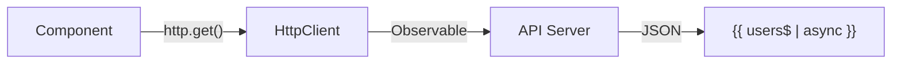

# 🟦 Exercise 1: GET Request - Solution



```typescript
import { HttpClient } from '@angular/common/http';
import { inject } from '@angular/core';

@Component({
  template: `
    @if (loading()) {
      <p>Loading...</p>
    }
    
    @for (user of users$ | async; track user.id) {
      <div>{{ user.name }} - {{ user.email }}</div>
    }
  `
})
export class UsersComponent {
  private http = inject(HttpClient);
  
  loading = signal(true);
  
  users$ = this.http.get<User[]>('/api/users').pipe(
    tap(() => this.loading.set(false))
  );
}
```
