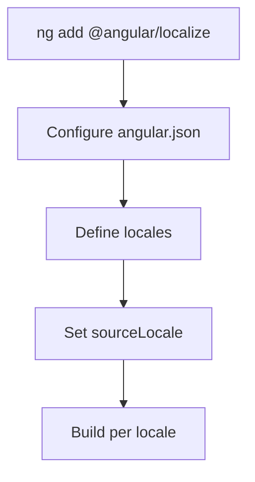
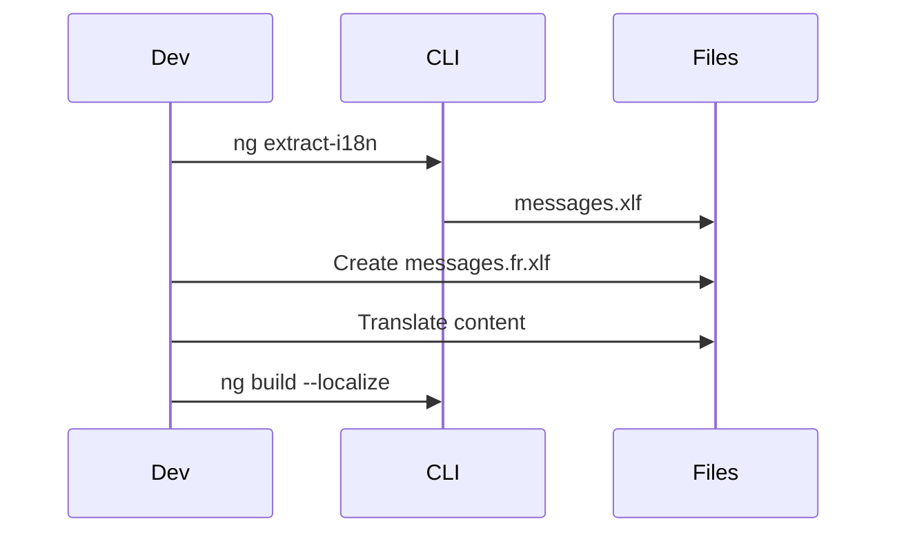

# 🌍 i18n Practice Exercises

## Overview
Master Angular internationalization (i18n) including translation setup, message extraction, runtime language switching, and RTL support.

---

## 📚 Basic Exercises (4)

### Exercise 1: i18n Setup
**Objective**: Configure Angular i18n with @angular/localize.

#### Problem Statement
Set up internationalization support in an Angular application with multiple locales.

#### Requirements
- Add @angular/localize package
- Configure angular.json for locales
- Set source locale
- Configure build targets per locale

#### Solution Flow


#### Key Concepts
```json
{
  "i18n": {
    "sourceLocale": "en-US",
    "locales": {
      "fr": "src/locale/messages.fr.xlf",
      "de": "src/locale/messages.de.xlf"
    }
  }
}
```

---

### Exercise 2: Mark for Translation
**Objective**: Use i18n attributes to mark translatable content.

#### Problem Statement
Mark various content types for translation including text, attributes, and plurals.

#### Requirements
- Use i18n attribute on elements
- Add description and meaning
- Mark attribute values with i18n-*
- Handle ICU expressions

#### Key Concepts
```html
<!-- Basic translation -->
<h1 i18n="site header|Main page heading@@homeTitle">Welcome</h1>

<!-- Attribute translation -->


<!-- Plural handling -->
<span i18n>{count, plural,
  =0 {No items}
  =1 {One item}
  other {{{count}} items}
}</span>
```

---

### Exercise 3: Extract & Translate
**Objective**: Generate and manage translation files.

#### Problem Statement
Extract messages, create translation files, and maintain them across updates.

#### Requirements
- Use ng extract-i18n command
- Generate XLIFF files
- Translate messages
- Merge updates

#### Solution Flow


---

### Exercise 4: Locale-Aware Pipes
**Objective**: Format dates, numbers, and currencies using locale.

#### Problem Statement
Display formatted data that respects the current locale settings.

#### Requirements
- Use DatePipe with locale
- Use CurrencyPipe with locale
- Use DecimalPipe with format
- Register locale data

#### Key Concepts
```typescript
import { registerLocaleData } from '@angular/common';
import localeFr from '@angular/common/locales/fr';
registerLocaleData(localeFr);

// Template
{{ date | date:'fullDate' }}  // "Monday, January 1, 2024"
{{ price | currency:'EUR' }}  // "€1,234.56"
```

---

## 🎯 Complex Scenarios (5)

### Scenario 1: Runtime Language Switching
**Objective**: Change language without page reload.

#### Use Case
User selects language from dropdown, UI updates immediately.

#### Key Concepts
```typescript
// Using ngx-translate
this.translate.use('fr');
this.translate.get('HELLO').subscribe(text => console.log(text));
```

---

### Scenario 2: Lazy Load Translations
**Objective**: Load translation files on demand.

#### Use Case
Only load needed locale data to reduce bundle size.

---

### Scenario 3: ngx-translate Integration
**Objective**: Use ngx-translate for dynamic translations.

#### Use Case
Runtime switching with JSON translation files.

---

### Scenario 4: ICU Message Format
**Objective**: Handle complex pluralization and selection.

#### Use Case
"You have 1 message" vs "You have 5 messages" in all locales.

---

### Scenario 5: RTL Support
**Objective**: Support right-to-left languages like Arabic and Hebrew.

#### Use Case
App layout mirrors for RTL languages.

---

## 🔑 Key Takeaways
1. **Build-time i18n**: Angular's default, fast runtime
2. **Runtime i18n**: ngx-translate for dynamic switching
3. **ICU format**: Standard for plurals/selects
4. **Locale pipes**: Automatic formatting
5. **RTL**: CSS logical properties help

## 📖 Resources
- [Angular i18n Guide](https://angular.io/guide/i18n-overview)
- [ngx-translate](https://github.com/ngx-translate/core)
- [ICU Message Format](https://unicode-org.github.io/icu/userguide/format_parse/messages/)
