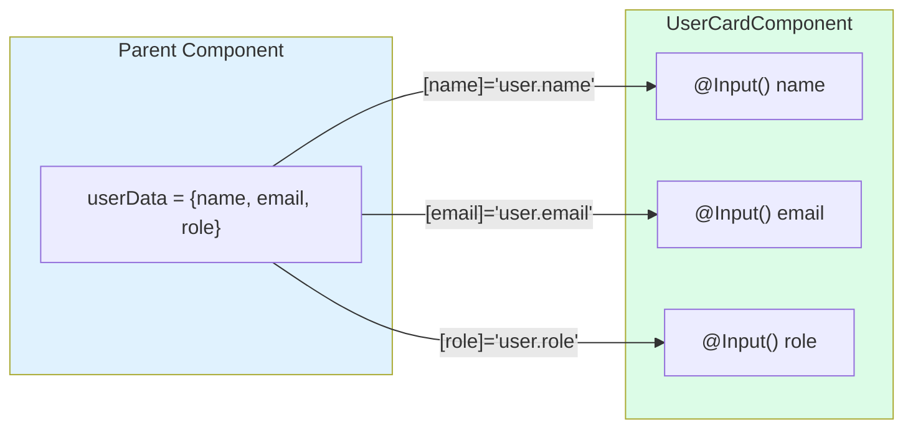
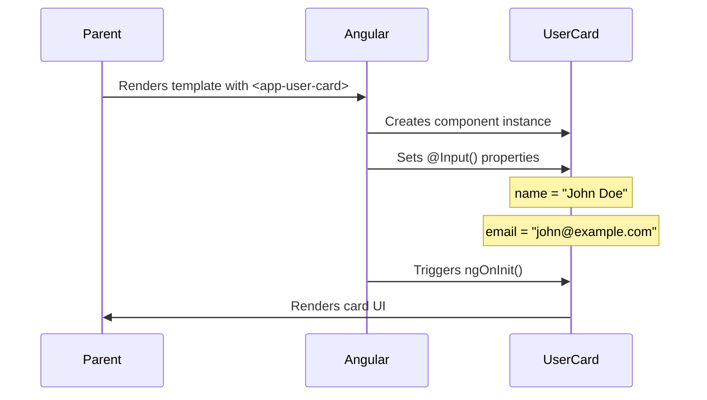

# 🟦 Exercise 1: Simple Input Binding - Solution

## 🎯 Approach Summary

Create a standalone child component with `@Input()` decorated properties, then use it from a parent component by passing data through property binding.

---

## 📊 Data Flow Diagram



---

## 🔄 Component Interaction Flow



---

## 📝 Step-by-Step Implementation

### Step 1: Create the Child Component

```typescript
import { Component, Input } from '@angular/core';
import { CommonModule } from '@angular/common';

@Component({
  selector: 'app-user-card',
  standalone: true,
  imports: [CommonModule],
  template: `
    <div class="user-card">
      <h3>👤 {{ name }}</h3>
      <p class="email">{{ email }}</p>
      <p class="role">Role: {{ role }}</p>
    </div>
  `,
  styles: [`
    .user-card {
      padding: 1rem;
      border: 1px solid #e5e7eb;
      border-radius: 8px;
      background: white;
    }
    .email { color: #6b7280; }
    .role { font-weight: 500; color: #8b5cf6; }
  `]
})
export class UserCardComponent {
  @Input() name = '';           // Required input
  @Input() email = '';          // Required input
  @Input() role = 'User';       // Optional with default
}
```

### Step 2: Use in Parent Component

```typescript
@Component({
  selector: 'app-parent',
  standalone: true,
  imports: [UserCardComponent],
  template: `
    <div class="user-grid">
      @for (user of users; track user.email) {
        <app-user-card 
          [name]="user.name"
          [email]="user.email"
          [role]="user.role">
        </app-user-card>
      }
    </div>
  `
})
export class ParentComponent {
  users = [
    { name: 'John Doe', email: 'john@example.com', role: 'Admin' },
    { name: 'Jane Smith', email: 'jane@example.com', role: 'Developer' },
    { name: 'Bob Wilson', email: 'bob@example.com', role: 'Designer' }
  ];
}
```

---

## 🔑 Key Concepts

### 1. @Input() Decorator
```typescript
@Input() propertyName: Type;
```
- Marks a property as bindable from parent
- Can have default values
- Triggers `ngOnChanges` when value changes

### 2. Property Binding Syntax
```html
<child-component [inputProperty]="parentValue"></child-component>
```
- Square brackets `[]` indicate property binding
- Right side is a TypeScript expression

### 3. Input with Defaults
```typescript
@Input() role = 'User';  // Default value if not provided
```

---

## ⚠️ Common Mistakes

| Mistake | Problem | Solution |
|---------|---------|----------|
| Forgetting `@Input()` | Property won't receive values | Always add decorator |
| Using `inputs` array | Outdated pattern | Use `@Input()` decorator |
| Not importing component | Template error | Add to `imports` array |
| Missing `[]` in binding | Passes literal string | Use `[prop]="expression"` |

---

## 🧪 Testing Tips

```typescript
it('should display user name', () => {
  component.name = 'Test User';
  fixture.detectChanges();
  
  const nameElement = fixture.nativeElement.querySelector('h3');
  expect(nameElement.textContent).toContain('Test User');
});
```

---

## ✨ Best Practices

1. **Type your inputs** - Use TypeScript types for safety
2. **Provide defaults** - Prevent undefined errors
3. **Use required** - Angular 16+ supports `@Input({ required: true })`
4. **Document inputs** - Add JSDoc comments for clarity
