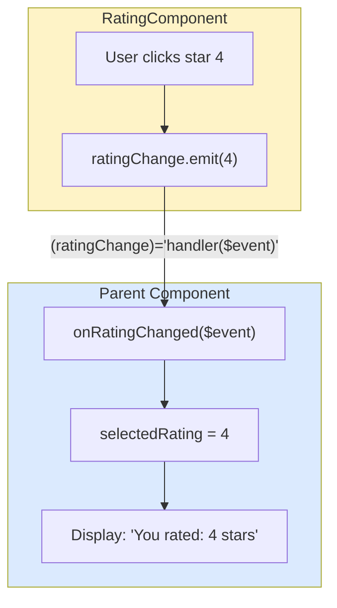
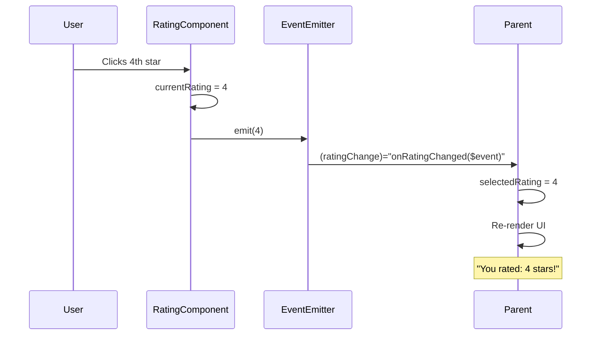

# 🟦 Exercise 2: Output Events - Solution

## 🎯 Approach Summary

Create a child component with an `@Output()` EventEmitter that emits rating values when stars are clicked. Parent listens to this event and updates its own state.

---

## 📊 Event Flow Diagram



---

## 🔄 Sequence Diagram



---

## 📝 Step-by-Step Implementation

### Step 1: Create Rating Component with Output

```typescript
import { Component, Output, EventEmitter, signal } from '@angular/core';
import { CommonModule } from '@angular/common';

@Component({
  selector: 'app-rating',
  standalone: true,
  imports: [CommonModule],
  template: `
    <div class="stars">
      @for (star of stars; track star) {
        <span 
          class="star" 
          [class.filled]="star <= currentRating()"
          (click)="selectRating(star)">
          {{ star <= currentRating() ? '★' : '☆' }}
        </span>
      }
    </div>
  `,
  styles: [`
    .stars { display: flex; gap: 0.25rem; }
    .star { 
      font-size: 2rem; 
      cursor: pointer; 
      color: #d1d5db;
      transition: color 0.2s;
    }
    .star.filled { color: #fbbf24; }
    .star:hover { color: #f59e0b; }
  `]
})
export class RatingComponent {
  // Array of star numbers [1, 2, 3, 4, 5]
  stars = [1, 2, 3, 4, 5];
  
  // Internal state
  currentRating = signal(0);
  
  // OUTPUT: Emit rating to parent
  @Output() ratingChange = new EventEmitter<number>();
  
  selectRating(rating: number): void {
    this.currentRating.set(rating);
    this.ratingChange.emit(rating);  // 🔔 Notify parent!
  }
}
```

### Step 2: Parent Component Listening to Event

```typescript
@Component({
  selector: 'app-parent',
  standalone: true,
  imports: [RatingComponent],
  template: `
    <h2>Rate this product:</h2>
    
    <!-- Listen to child's output event -->
    <app-rating (ratingChange)="onRatingChanged($event)"></app-rating>
    
    @if (userRating()) {
      <p class="result">You rated: {{ userRating() }} stars! ⭐</p>
    }
  `
})
export class ParentComponent {
  userRating = signal(0);
  
  // Handler for child's event
  onRatingChanged(rating: number): void {
    this.userRating.set(rating);
    console.log('Rating received:', rating);
  }
}
```

---

## 🔑 Key Concepts

### 1. @Output() Decorator
```typescript
@Output() eventName = new EventEmitter<DataType>();
```
- Declares an output property
- Must be initialized with EventEmitter

### 2. EventEmitter
```typescript
// Emit a value
this.eventName.emit(value);

// Emit without value
this.eventName.emit();
```

### 3. Event Binding Syntax
```html
<child (outputEvent)="parentHandler($event)"></child>
```
- Parentheses `()` for event binding
- `$event` contains the emitted value

---

## ⚠️ Common Mistakes

| Mistake | Problem | Solution |
|---------|---------|----------|
| Forgetting `new EventEmitter()` | Null reference error | Always initialize |
| Missing `$event` | Value not received | Use `handler($event)` |
| Wrong EventEmitter type | Type errors | Match `EventEmitter<Type>` |
| Calling emit without () | Doesn't work | Use `emit(value)` not `emit` |

---

## 🧪 Testing Tips

```typescript
it('should emit rating on star click', () => {
  spyOn(component.ratingChange, 'emit');
  
  component.selectRating(4);
  
  expect(component.ratingChange.emit).toHaveBeenCalledWith(4);
});
```

---

## ✨ Output vs EventEmitter (Modern Angular)

```typescript
// Traditional (still valid)
@Output() change = new EventEmitter<string>();

// Angular 17+ alternative using output()
change = output<string>();  // Cleaner syntax!
```
