# 🟦 Exercise 3: Two-Way Binding - Solution

## 🎯 Approach Summary

Combine `@Input()` and `@Output()` with the naming convention `propertyName` + `propertyNameChange` to enable two-way binding with `[(propertyName)]`.

---

## 📊 Two-Way Binding Flow


---

## 🔄 Bidirectional Data Flow

```mermaid
sequenceDiagram
    participant Parent
    participant Counter
    
    Note over Parent,Counter: Parent → Child (Input)
    Parent->>Counter: [count]="5"
    Counter->>Counter: Display 5
    
    Note over Parent,Counter: Child → Parent (Output)
    Counter->>Counter: User clicks [+]
    Counter->>Counter: count = 6
    Counter->>Parent: countChange.emit(6)
    Parent->>Parent: quantity = 6
```



---

## 📝 Implementation

### Step 1: Counter Component

```typescript
import { Component, Input, Output, EventEmitter } from '@angular/core';

@Component({
  selector: 'app-counter',
  standalone: true,
  template: `
    <div class="counter">
      <button (click)="decrement()">-</button>
      <span>{{ count }}</span>
      <button (click)="increment()">+</button>
    </div>
  `
})
export class CounterComponent {
  // INPUT: Receive value from parent
  @Input() count = 0;
  
  // OUTPUT: Must be named {inputName}Change for [()] to work!
  @Output() countChange = new EventEmitter<number>();
  
  increment(): void {
    this.count++;
    this.countChange.emit(this.count);  // Notify parent
  }
  
  decrement(): void {
    this.count--;
    this.countChange.emit(this.count);  // Notify parent
  }
}
```

### Step 2: Parent Usage

```typescript
@Component({
  template: `
    <p>Parent quantity: {{ quantity }}</p>
    
    <!-- Two-way binding with banana-in-a-box -->
    <app-counter [(count)]="quantity"></app-counter>
    
    <button (click)="quantity = 1">Reset to 1</button>
  `
})
export class ParentComponent {
  quantity = 5;
}
```

---

## 🔑 The Magic Formula

```
[(x)] = [x] + (xChange)
```

```html
<!-- This shorthand: -->
<app-counter [(count)]="quantity"></app-counter>

<!-- Expands to: -->
<app-counter 
  [count]="quantity" 
  (countChange)="quantity = $event">
</app-counter>
```

---

## ⚠️ Common Mistakes

| Mistake | Why It Fails |
|---------|--------------|
| `@Output() countChanged` | Must be `countChange` (no 'd') |
| Forgetting to emit | Parent never updates |
| Not updating internal value | UI doesn't reflect change |

---

## ✨ Modern Alternative (Angular 17+)

```typescript
// Using model() signal
count = model(0);

// In template - automatically two-way bindable!
<input [ngModel]="count()" (ngModelChange)="count.set($event)">
```
