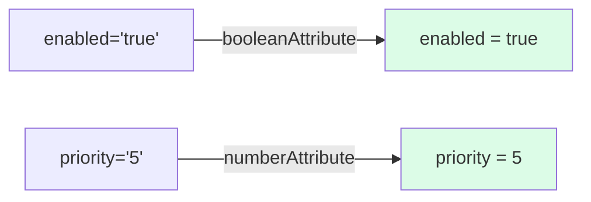

# 🟦 Exercise 4: Input Transform - Solution

## 📝 Implementation

```typescript
import { Component, Input, booleanAttribute, numberAttribute } from '@angular/core';

@Component({
  selector: 'app-feature-flag',
  template: `
    <div [class.enabled]="enabled">
      Feature: {{ enabled ? '✅ ON' : '❌ OFF' }}
      Priority: {{ priority }}
    </div>
  `
})
export class FeatureFlagComponent {
  // Transform "true"/"false" strings to boolean
  @Input({ transform: booleanAttribute }) enabled = false;
  
  // Transform string numbers to number
  @Input({ transform: numberAttribute }) priority = 0;
}
```

## Usage

```html
<!-- String "true" becomes boolean true -->
<app-feature-flag enabled="true" priority="5"></app-feature-flag>
```

## 📊 Transform Flow


