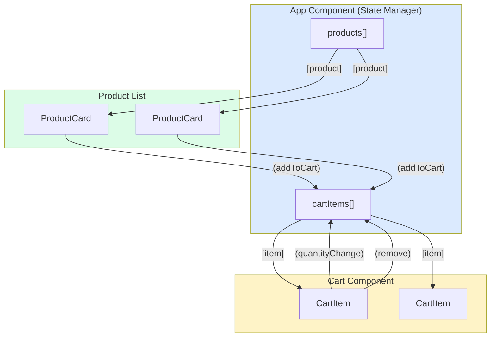

# 🟥 Scenario 1: Shopping Cart - Solution

## 📊 Component Communication Map



---

## 📝 Implementation

### ProductCard Component
```typescript
@Component({
  selector: 'app-product-card',
  template: `
    <div class="product">
      <h3>{{ product.name }}</h3>
      <p>\${{ product.price }}</p>
      <button (click)="onAdd()">Add to Cart</button>
    </div>
  `
})
export class ProductCardComponent {
  @Input() product!: Product;
  @Output() addToCart = new EventEmitter<Product>();
  
  onAdd(): void {
    this.addToCart.emit(this.product);
  }
}
```

### Cart Item Component
```typescript
@Component({
  selector: 'app-cart-item',
  template: `
    <div class="cart-item">
      <span>{{ item.product.name }}</span>
      <button (click)="decrease()">-</button>
      <span>{{ item.quantity }}</span>
      <button (click)="increase()">+</button>
      <span>\${{ item.product.price * item.quantity }}</span>
      <button (click)="onRemove()">🗑️</button>
    </div>
  `
})
export class CartItemComponent {
  @Input() item!: CartItem;
  @Output() quantityChange = new EventEmitter<{id: number, quantity: number}>();
  @Output() remove = new EventEmitter<number>();
  
  increase(): void {
    this.quantityChange.emit({
      id: this.item.product.id,
      quantity: this.item.quantity + 1
    });
  }
  
  decrease(): void {
    if (this.item.quantity > 1) {
      this.quantityChange.emit({
        id: this.item.product.id,
        quantity: this.item.quantity - 1
      });
    }
  }
  
  onRemove(): void {
    this.remove.emit(this.item.product.id);
  }
}
```

### Parent Component
```typescript
@Component({
  template: `
    <div class="products">
      @for (product of products; track product.id) {
        <app-product-card 
          [product]="product"
          (addToCart)="addToCart($event)">
        </app-product-card>
      }
    </div>
    
    <div class="cart">
      @for (item of cartItems; track item.product.id) {
        <app-cart-item
          [item]="item"
          (quantityChange)="updateQuantity($event)"
          (remove)="removeItem($event)">
        </app-cart-item>
      }
      <p>Total: \${{ getTotal() }}</p>
    </div>
  `
})
export class AppComponent {
  products: Product[] = [...];
  cartItems: CartItem[] = [];
  
  addToCart(product: Product): void {
    const existing = this.cartItems.find(i => i.product.id === product.id);
    if (existing) {
      existing.quantity++;
    } else {
      this.cartItems.push({ product, quantity: 1 });
    }
  }
  
  updateQuantity(event: {id: number, quantity: number}): void {
    const item = this.cartItems.find(i => i.product.id === event.id);
    if (item) item.quantity = event.quantity;
  }
  
  removeItem(id: number): void {
    this.cartItems = this.cartItems.filter(i => i.product.id !== id);
  }
  
  getTotal(): number {
    return this.cartItems.reduce((sum, item) => 
      sum + item.product.price * item.quantity, 0);
  }
}
```

---

## 🔑 Key Takeaways

1. **Parent owns the state** - Cart data lives in parent
2. **Children emit events** - Never mutate parent data directly
3. **Inputs for data down** - Products/cart items passed as inputs
4. **Outputs for events up** - Add/remove/update emit to parent
