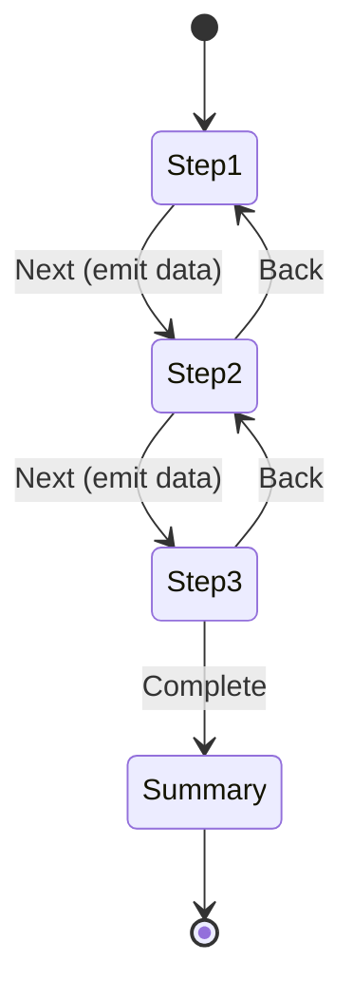

# 🟥 Scenario 2: Form Wizard - Solution

## 📊 Wizard Flow



## 📝 Implementation

```typescript
// Step Component
@Component({
  template: `
    <input [(ngModel)]="data.name">
    <button (click)="complete()">Next</button>
  `
})
export class Step1Component {
  @Input() data: any = {};
  @Output() stepComplete = new EventEmitter<any>();
  
  complete(): void {
    this.stepComplete.emit(this.data);
  }
}

// Parent Wizard
@Component({
  template: `
    @switch (currentStep) {
      @case (1) {
        <app-step1 [data]="formData.step1" (stepComplete)="onStep1Complete($event)"/>
      }
      @case (2) {
        <app-step2 [data]="formData.step2" (stepComplete)="onStep2Complete($event)"/>
      }
    }
    <button (click)="back()">Back</button>
  `
})
export class WizardComponent {
  currentStep = 1;
  formData = { step1: {}, step2: {} };
  
  onStep1Complete(data: any): void {
    this.formData.step1 = data;
    this.currentStep = 2;
  }
}
```
