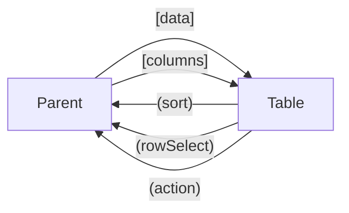

# 🟥 Scenario 3: Data Table

**Difficulty:** Advanced | **Time:** 40 minutes

---

## 📋 Problem Statement

Create a reusable data table component with sortable columns, row selection, and action buttons. All interactions should be communicated to the parent.

---

## ✅ Requirements

- [ ] `[data]` - Receives array of items
- [ ] `[columns]` - Column configuration
- [ ] `(sort)` - Emit when column header clicked
- [ ] `(rowSelect)` - Emit selected row
- [ ] `(action)` - Emit when action button clicked

---

## 📊 Component Interface

