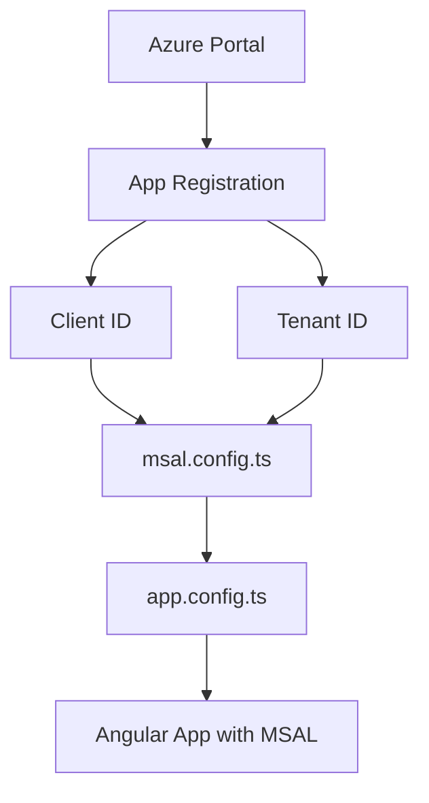

# Solution: MSAL Configuration

## 📊 Flow Diagram



## 💻 Implementation

### Step 1: Install Packages

```bash
npm install @azure/msal-angular @azure/msal-browser
```

### Step 2: Create MSAL Config

```typescript
// msal.config.ts
import { Configuration, BrowserCacheLocation } from '@azure/msal-browser';

export const msalConfig: Configuration = {
  auth: {
    clientId: 'YOUR_CLIENT_ID',
    authority: 'https://login.microsoftonline.com/YOUR_TENANT_ID',
    redirectUri: 'http://localhost:4200'
  },
  cache: {
    cacheLocation: BrowserCacheLocation.LocalStorage,
    storeAuthStateInCookie: false
  }
};
```

### Step 3: Configure Providers

```typescript
// app.config.ts
import { MsalModule, MsalService, MsalGuard, MsalInterceptor } from '@azure/msal-angular';
import { PublicClientApplication, InteractionType } from '@azure/msal-browser';
import { msalConfig } from './msal.config';

export const appConfig: ApplicationConfig = {
  providers: [
    importProvidersFrom(
      MsalModule.forRoot(
        new PublicClientApplication(msalConfig),
        {
          interactionType: InteractionType.Popup,
          authRequest: { scopes: ['user.read'] }
        },
        {
          interactionType: InteractionType.Popup,
          protectedResourceMap: new Map([
            ['https://graph.microsoft.com/v1.0/*', ['user.read']]
          ])
        }
      )
    )
  ]
};
```

## 🔑 Key Concepts

| Property | Purpose |
|----------|---------|
| clientId | Your app's ID from Azure |
| authority | Login endpoint with tenant |
| redirectUri | Where Azure sends user back |
| cacheLocation | Where to store tokens |
