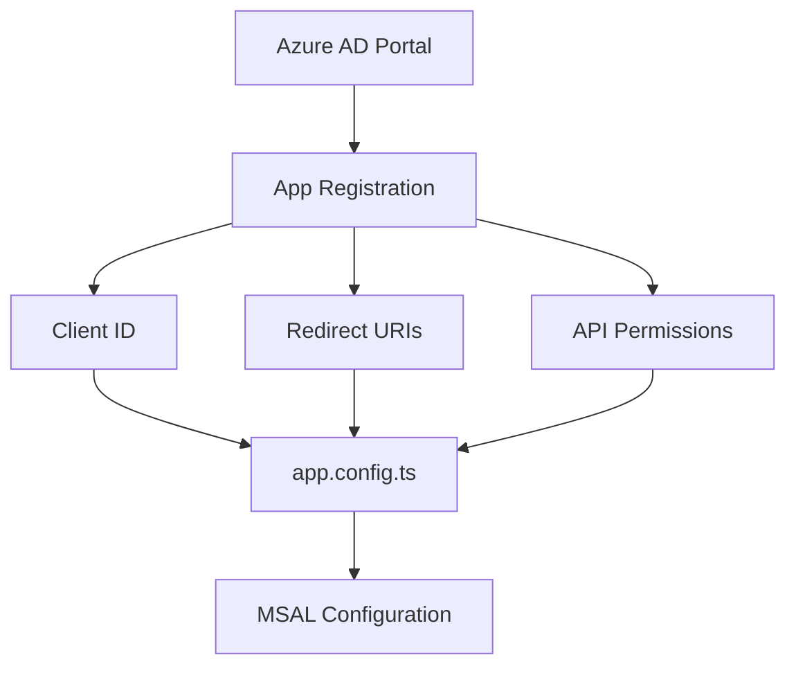
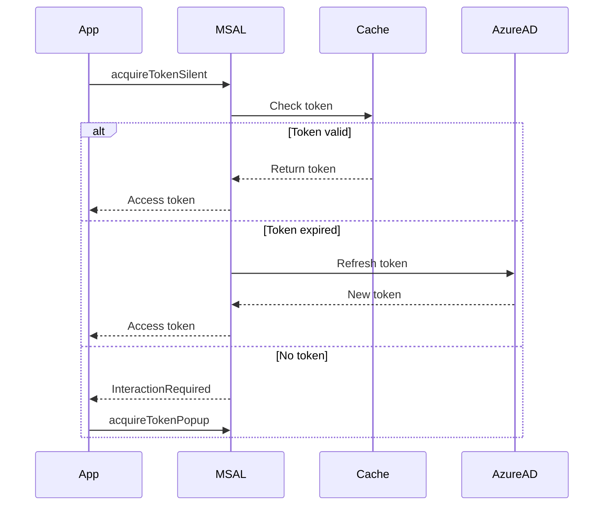

# 🔐 MSAL Auth Practice Exercises

## Overview
Master Azure AD Authentication in Angular using MSAL (Microsoft Authentication Library) including SSO, token management, role-based access, and B2C flows.

---

## 📚 Basic Exercises (4)

### Exercise 1: MSAL Configuration
**Objective**: Configure MSAL in a standalone Angular application.

#### Problem Statement
Set up MSAL with Azure AD tenant for authentication in an Angular 17+ app.

#### Requirements
- Install @azure/msal-angular and @azure/msal-browser
- Configure MSAL in app.config.ts
- Set up redirect URI and scopes
- Enable public client application

#### Solution Flow


#### Key Concepts
```typescript
export const msalConfig: Configuration = {
  auth: {
    clientId: 'your-client-id',
    authority: 'https://login.microsoftonline.com/tenant-id',
    redirectUri: 'http://localhost:4200'
  },
  cache: {
    cacheLocation: 'localStorage',
    storeAuthStateInCookie: false
  }
};
```

---

### Exercise 2: Login/Logout Flows
**Objective**: Implement popup and redirect login flows.

#### Problem Statement
Create an authentication service with login/logout functionality supporting both popup and redirect methods.

#### Requirements
- Implement popup login
- Implement redirect login
- Handle logout with redirect
- Store active account

#### Key Concepts
```typescript
login(): void {
  this.msalService.loginPopup().subscribe({
    next: (result) => {
      this.msalService.instance.setActiveAccount(result.account);
    },
    error: (error) => console.error(error)
  });
}
```

---

### Exercise 3: Token Acquisition
**Objective**: Acquire access tokens for API calls.

#### Problem Statement
Get access tokens silently for calling protected APIs, with fallback to interactive acquisition.

#### Requirements
- Use acquireTokenSilent for cached tokens
- Handle InteractionRequiredAuthError
- Configure scopes for API access
- Add token to HTTP headers

#### Solution Flow


---

### Exercise 4: Route Guards
**Objective**: Protect routes using MsalGuard.

#### Problem Statement
Implement route protection that requires authentication before accessing protected pages.

#### Requirements
- Use MsalGuard for route protection
- Configure guard with interaction type
- Handle unauthorized redirects
- Set up auth request options

---

## 🎯 Complex Scenarios (5)

### Scenario 1: Silent SSO
**Objective**: Implement seamless single sign-on using silent authentication.

#### Use Case
Enterprise users logged into Microsoft 365 should be automatically authenticated.

---

### Scenario 2: HTTP Interceptor
**Objective**: Automatically attach tokens to API requests.

#### Use Case
All requests to protected APIs include Authorization header.

#### Key Concepts
```typescript
export const msalInterceptorConfig: MsalInterceptorConfiguration = {
  interactionType: InteractionType.Popup,
  protectedResourceMap: new Map([
    ['https://graph.microsoft.com/v1.0/*', ['user.read']],
    ['https://your-api.com/*', ['api://your-api/access']]
  ])
};
```

---

### Scenario 3: Role-Based Access Control
**Objective**: Implement RBAC using Azure AD app roles.

#### Use Case
Admin users see dashboard, regular users see limited view.

---

### Scenario 4: Multi-Tenant Authentication
**Objective**: Support users from multiple Azure AD tenants.

#### Use Case
SaaS application accepting users from any organization.

---

### Scenario 5: Azure AD B2C
**Objective**: Implement B2C user flows for consumer apps.

#### Use Case
Sign-up, sign-in, password reset, and profile editing flows.

---

## 🔑 Key Takeaways
1. **MSAL-Angular**: Wrapper for MSAL-Browser
2. **Silent auth**: Try silent before interactive
3. **Token caching**: Automatic with proper config
4. **Scopes**: Define what access is needed
5. **Guards**: Protect routes declaratively

## 📖 Resources
- [MSAL Angular Tutorial](https://docs.microsoft.com/azure/active-directory/develop/tutorial-v2-angular-auth-code)
- [Azure AD B2C](https://docs.microsoft.com/azure/active-directory-b2c/)
- [Microsoft Identity Platform](https://docs.microsoft.com/azure/active-directory/develop/)
