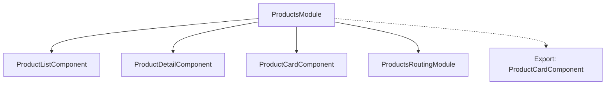

# Exercise 1: Feature Modules

## 🎯 Objective

Organize application features into cohesive NgModules.

## ✅ Requirements

- [ ] Create ProductsModule
- [ ] Declare feature components
- [ ] Import routing module
- [ ] Export public components

## 💻 Solution

```typescript
// products/products.module.ts
@NgModule({
  declarations: [
    ProductListComponent,
    ProductDetailComponent,
    ProductCardComponent
  ],
  imports: [
    CommonModule,
    ProductsRoutingModule
  ],
  exports: [
    ProductCardComponent  // Public API
  ]
})
export class ProductsModule { }
```

## 📊 Module Structure


