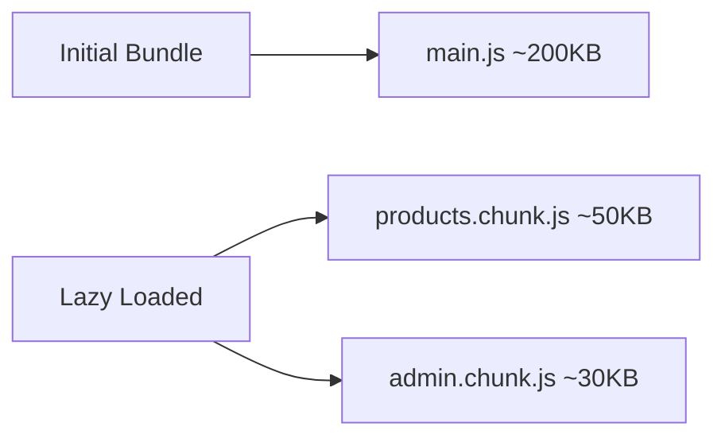

# Exercise 4: Lazy Loading

## 🎯 Objective

Configure lazy loading for feature modules.

## ✅ Requirements

- [ ] Use loadChildren with dynamic import
- [ ] Set up feature routing
- [ ] Verify separate chunk is created

## 💻 Solution

```typescript
// app.routes.ts
export const routes: Routes = [
  { path: '', component: HomeComponent },
  {
    path: 'products',
    loadChildren: () => import('./products/products.module')
      .then(m => m.ProductsModule)
  },
  {
    path: 'admin',
    loadChildren: () => import('./admin/admin.module')
      .then(m => m.AdminModule)
  }
];
```

## 📊 Bundle Impact


