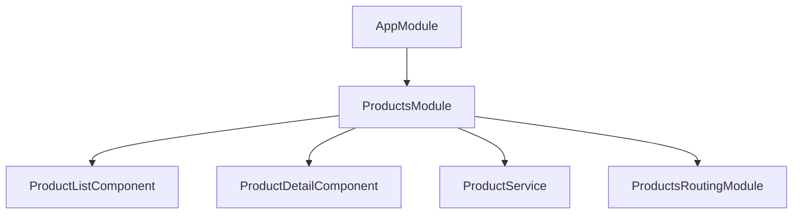
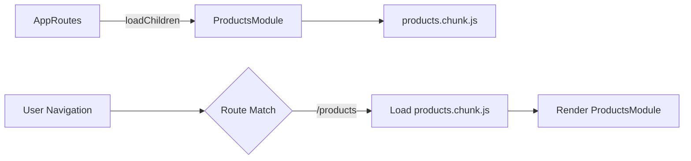

# 📦 NgModule Practice Exercises

## Overview
Master Angular's module-based architecture including feature modules, shared modules, core module patterns, lazy loading, and migration strategies to standalone.

---

## 📚 Basic Exercises (4)

### Exercise 1: Feature Modules
**Objective**: Organize application features into cohesive modules.

#### Problem Statement
Create a ProductsModule that encapsulates all product-related components, services, and routing.

#### Requirements
- Declare feature components
- Import CommonModule and routing
- Export public components
- Register feature-specific services

#### Solution Flow


#### Key Concepts
```typescript
@NgModule({
  declarations: [
    ProductListComponent,
    ProductDetailComponent,
    ProductCardComponent
  ],
  imports: [
    CommonModule,
    ProductsRoutingModule
  ],
  exports: [ProductCardComponent]
})
export class ProductsModule { }
```

---

### Exercise 2: Shared Module
**Objective**: Create a reusable module for common components, directives, and pipes.

#### Problem Statement
Build a SharedModule containing UI components used across multiple features.

#### Requirements
- Export CommonModule for consumers
- Declare shared components/directives/pipes
- No service providers (use providedIn: 'root')
- Re-export common Angular modules

#### Key Concepts
```typescript
@NgModule({
  imports: [CommonModule, FormsModule],
  declarations: [ButtonComponent, CardComponent, HighlightDirective],
  exports: [
    CommonModule,
    FormsModule,
    ButtonComponent,
    CardComponent,
    HighlightDirective
  ]
})
export class SharedModule { }
```

---

### Exercise 3: Core Module
**Objective**: Implement a CoreModule for singleton services and app-wide components.

#### Problem Statement
Create a CoreModule that provides singleton services and prevents multiple imports.

#### Requirements
- Provide singleton services
- Include app-level components (navbar, footer)
- Throw error if imported more than once
- Import only in AppModule

#### Key Concepts
```typescript
@NgModule({
  providers: [AuthService, LoggingService],
  declarations: [NavbarComponent, FooterComponent],
  exports: [NavbarComponent, FooterComponent]
})
export class CoreModule {
  constructor(@Optional() @SkipSelf() parentModule: CoreModule) {
    if (parentModule) {
      throw new Error('CoreModule already loaded. Import only in AppModule.');
    }
  }
}
```

---

### Exercise 4: Lazy Loading Modules
**Objective**: Load feature modules on-demand for better performance.

#### Problem Statement
Configure lazy loading for ProductsModule to reduce initial bundle size.

#### Requirements
- Use loadChildren with dynamic import
- Set up feature routing module
- Preload strategy selection
- Verify separate chunk creation

#### Solution Flow


---

## 🎯 Complex Scenarios (5)

### Scenario 1: forRoot/forChild Pattern
**Objective**: Configure modules with different providers for root vs feature contexts.

#### Use Case
Router module or custom configuration modules that need different setup at root vs feature level.

#### Key Concepts
```typescript
@NgModule({...})
export class MyModule {
  static forRoot(config: Config): ModuleWithProviders<MyModule> {
    return {
      ngModule: MyModule,
      providers: [
        { provide: CONFIG_TOKEN, useValue: config },
        MyService
      ]
    };
  }
  
  static forChild(): ModuleWithProviders<MyModule> {
    return { ngModule: MyModule };
  }
}
```

---

### Scenario 2: Module Provider Scoping
**Objective**: Understand and control service scopes across modules.

#### Use Case
Feature-scoped vs application-scoped service instances.

---

### Scenario 3: Barrel Exports
**Objective**: Organize exports using index.ts files.

#### Use Case
Clean import paths: `import { X, Y } from '@app/shared'`

---

### Scenario 4: Widget Module Pattern
**Objective**: Create embeddable widget modules for micro-frontend architecture.

#### Use Case
Reusable module that can be dropped into any Angular application.

---

### Scenario 5: Migration to Standalone
**Objective**: Migrate from NgModule-based to standalone components.

#### Use Case
Modernize existing app using Angular's migration schematic.

---

## 🔑 Key Takeaways
1. **Feature modules**: Encapsulate related features
2. **Shared module**: DRY for common utilities
3. **Core module**: Singleton services, import once
4. **Lazy loading**: Improve initial load time
5. **forRoot/forChild**: Different configs per context

## 📖 Resources
- [NgModules Guide](https://angular.io/guide/ngmodules)
- [Lazy Loading](https://angular.io/guide/lazy-loading-ngmodules)
- [Standalone Migration](https://angular.io/guide/standalone-migration)
