# Solution: Store Setup

## 🧠 Approach

NgRx store setup in standalone Angular involves:
1. Install NgRx packages
2. Configure providers in app.config.ts
3. Create state interfaces
4. Enable DevTools conditionally

## 📊 Flow Diagram

```mermaid
flowchart TD
    subgraph Setup["🔧 NgRx Setup"]
        A[Install Packages] --> B[app.config.ts]
        B --> C[provideStore]
        B --> D[provideEffects]
        B --> E[provideStoreDevtools]
    end
    
    subgraph Runtime["⚡ Runtime"]
        C --> F[Root Store]
        D --> G[Effects Registry]
        E --> H{isDevMode?}
        H -->|Yes| I[Enable DevTools]
        H -->|No| J[Skip DevTools]
    end
    
    style A fill:#e0f2fe
    style F fill:#dcfce7
    style I fill:#fef3c7
```



## 💻 Implementation

### Step 1: Install Packages

```bash
npm install @ngrx/store @ngrx/effects @ngrx/store-devtools
```

### Step 2: Create App State Interface

```typescript
// store/app.state.ts
export interface AppState {
  // Feature states will be added here
}
```

### Step 3: Configure app.config.ts

```typescript
import { ApplicationConfig, isDevMode } from '@angular/core';
import { provideRouter } from '@angular/router';
import { provideStore } from '@ngrx/store';
import { provideEffects } from '@ngrx/effects';
import { provideStoreDevtools } from '@ngrx/store-devtools';
import { routes } from './app.routes';

export const appConfig: ApplicationConfig = {
  providers: [
    provideRouter(routes),
    
    // NgRx Store - root state
    provideStore({}),
    
    // NgRx Effects - root effects
    provideEffects([]),
    
    // Redux DevTools - development only
    provideStoreDevtools({
      maxAge: 25,           // Retain last 25 states
      logOnly: !isDevMode(), // Log-only in production
      autoPause: true,       // Pause on tab blur
      trace: false           // Disable stack trace
    })
  ]
};
```

### Step 4: Verify in Browser

1. Open browser DevTools
2. Go to "Redux" tab (install Redux DevTools extension)
3. You should see the store with initial empty state

## 🔑 Key Concepts

### Provider Functions (Angular 15+)
Modern NgRx uses provider functions instead of modules:

```typescript
// ❌ Old way (NgModule)
StoreModule.forRoot({})

// ✅ New way (Standalone)
provideStore({})
```

### DevTools Configuration

| Option | Description |
|--------|-------------|
| `maxAge` | Max actions in history |
| `logOnly` | Disable time-travel in prod |
| `autoPause` | Pause when tab loses focus |
| `trace` | Include stack traces |

## ⚠️ Common Mistakes

1. **Forgetting isDevMode check**
   - DevTools in production exposes state structure

2. **Not installing all packages**
   - Store, Effects, and DevTools are separate packages

3. **Using old module-based syntax**
   - Standalone apps use provider functions

## 🎯 Testing

```typescript
describe('App Store', () => {
  it('should initialize with empty state', () => {
    TestBed.configureTestingModule({
      providers: [provideStore({})]
    });
    const store = TestBed.inject(Store);
    // Store should be defined
    expect(store).toBeTruthy();
  });
});
```
