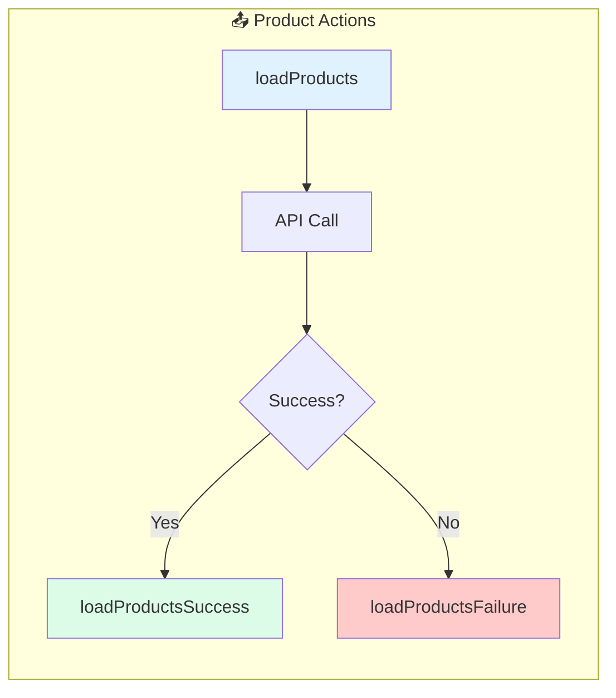

# Solution: Actions

## 🧠 Approach

NgRx actions describe unique events in your application. They should be:
- Descriptive of what happened
- Type-safe with TypeScript
- Easily traceable in DevTools

## 📊 Flow Diagram



## 💻 Implementation

### Step 1: Define Product Interface

```typescript
// models/product.model.ts
export interface Product {
  id: string;
  name: string;
  price: number;
  description: string;
}
```

### Step 2: Create Actions

```typescript
// store/products/products.actions.ts
import { createAction, props } from '@ngrx/store';
import { Product } from '../../models/product.model';

// Load actions
export const loadProducts = createAction(
  '[Products Page] Load Products'
);

export const loadProductsSuccess = createAction(
  '[Products API] Load Products Success',
  props<{ products: Product[] }>()
);

export const loadProductsFailure = createAction(
  '[Products API] Load Products Failure',
  props<{ error: string }>()
);

// CRUD actions
export const addProduct = createAction(
  '[Product Form] Add Product',
  props<{ product: Product }>()
);

export const updateProduct = createAction(
  '[Product Form] Update Product',
  props<{ product: Product }>()
);

export const deleteProduct = createAction(
  '[Products Page] Delete Product',
  props<{ id: string }>()
);
```

### Step 3: Dispatch Actions

```typescript
// In component
import { Store } from '@ngrx/store';
import * as ProductActions from './store/products/products.actions';

@Component({...})
export class ProductsComponent {
  private store = inject(Store);
  
  ngOnInit() {
    this.store.dispatch(ProductActions.loadProducts());
  }
  
  onDelete(id: string) {
    this.store.dispatch(ProductActions.deleteProduct({ id }));
  }
}
```

## 🔑 Key Concepts

### Action Naming Convention
```
[Source] Event Description
```

| Part | Example | Purpose |
|------|---------|---------|
| Source | `[Products Page]` | Where action originated |
| Event | `Load Products` | What happened |

### Props vs No Props

```typescript
// No payload
export const loadProducts = createAction('[Products] Load');

// With payload
export const addProduct = createAction(
  '[Products] Add',
  props<{ product: Product }>()
);
```

## ⚠️ Common Mistakes

1. **Imperative naming**: Use "Load Products" not "loadProducts()"
2. **Missing source**: Always include `[Feature]` prefix
3. **Putting logic in actions**: Actions are data, not behavior

## 🎯 Testing

```typescript
describe('Products Actions', () => {
  it('should create loadProducts action', () => {
    const action = loadProducts();
    expect(action.type).toBe('[Products Page] Load Products');
  });
  
  it('should create loadProductsSuccess with products', () => {
    const products = [{ id: '1', name: 'Test', price: 10 }];
    const action = loadProductsSuccess({ products });
    expect(action.products).toEqual(products);
  });
});
```
