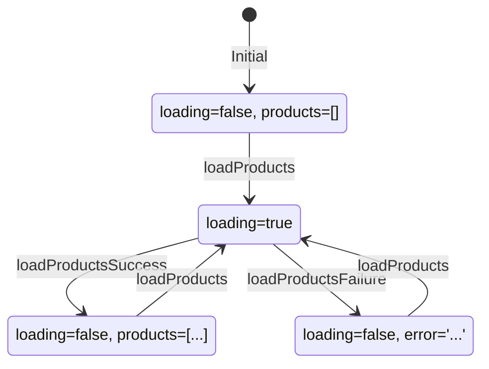

# Solution: Reducers

## 🧠 Approach

Reducers are pure functions that take current state and action, returning new state. Key principles:
1. Never mutate state directly
2. Always return new references
3. Handle all relevant actions

## 📊 State Transition Diagram



## 💻 Implementation

```typescript
// store/products/products.reducer.ts
import { createReducer, on } from '@ngrx/store';
import { Product } from '../../models/product.model';
import * as ProductActions from './products.actions';

export interface ProductsState {
  products: Product[];
  loading: boolean;
  error: string | null;
}

const initialState: ProductsState = {
  products: [],
  loading: false,
  error: null
};

export const productsReducer = createReducer(
  initialState,
  
  // Load
  on(ProductActions.loadProducts, (state) => ({
    ...state,
    loading: true,
    error: null
  })),
  
  on(ProductActions.loadProductsSuccess, (state, { products }) => ({
    ...state,
    products,
    loading: false
  })),
  
  on(ProductActions.loadProductsFailure, (state, { error }) => ({
    ...state,
    loading: false,
    error
  })),
  
  // CRUD
  on(ProductActions.addProduct, (state, { product }) => ({
    ...state,
    products: [...state.products, product]
  })),
  
  on(ProductActions.updateProduct, (state, { product }) => ({
    ...state,
    products: state.products.map(p => 
      p.id === product.id ? product : p
    )
  })),
  
  on(ProductActions.deleteProduct, (state, { id }) => ({
    ...state,
    products: state.products.filter(p => p.id !== id)
  }))
);
```

### Register in Store

```typescript
// app.config.ts
import { productsReducer } from './store/products/products.reducer';

export const appConfig: ApplicationConfig = {
  providers: [
    provideStore({ products: productsReducer }),
    // ...
  ]
};
```

## 🔑 Key Concepts

### Immutability

```typescript
// ❌ Wrong - mutates state
on(addProduct, (state, { product }) => {
  state.products.push(product);
  return state;
})

// ✅ Correct - new array
on(addProduct, (state, { product }) => ({
  ...state,
  products: [...state.products, product]
}))
```

## ⚠️ Common Mistakes

1. **Mutating state**: Always create new objects/arrays
2. **Missing spread**: Forgetting `...state` loses other properties
3. **Not handling all actions**: Every action should have a handler

## 🎯 Testing

```typescript
describe('productsReducer', () => {
  it('should set loading true on loadProducts', () => {
    const state = productsReducer(initialState, loadProducts());
    expect(state.loading).toBe(true);
  });
  
  it('should store products on success', () => {
    const products = [{ id: '1', name: 'Test' }];
    const state = productsReducer(
      { ...initialState, loading: true },
      loadProductsSuccess({ products })
    );
    expect(state.products).toEqual(products);
    expect(state.loading).toBe(false);
  });
});
```
