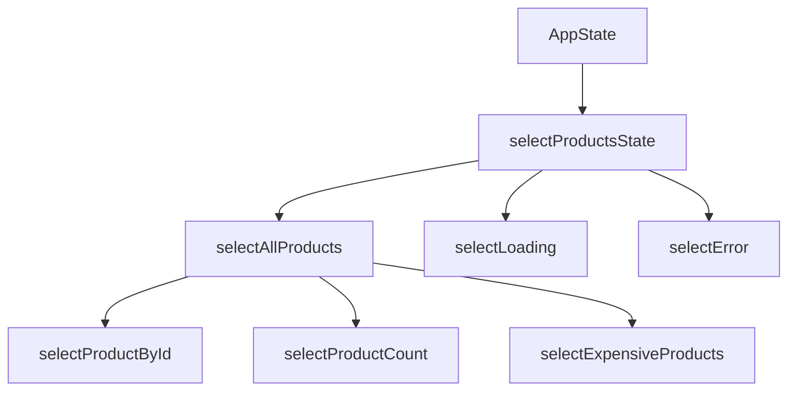

# Solution: Selectors

## 🧠 Approach

Selectors are pure functions that extract and derive data from state. They're memoized for performance.

## 📊 Selector Composition



## 💻 Implementation

```typescript
// store/products/products.selectors.ts
import { createFeatureSelector, createSelector } from '@ngrx/store';
import { ProductsState } from './products.reducer';

// Feature selector
export const selectProductsState = 
  createFeatureSelector<ProductsState>('products');

// Basic selectors
export const selectAllProducts = createSelector(
  selectProductsState,
  (state) => state.products
);

export const selectLoading = createSelector(
  selectProductsState,
  (state) => state.loading
);

export const selectError = createSelector(
  selectProductsState,
  (state) => state.error
);

// Derived selectors
export const selectProductCount = createSelector(
  selectAllProducts,
  (products) => products.length
);

// Parameterized selector (factory)
export const selectProductById = (id: string) => createSelector(
  selectAllProducts,
  (products) => products.find(p => p.id === id)
);

// Filtered selector
export const selectExpensiveProducts = (minPrice: number) => createSelector(
  selectAllProducts,
  (products) => products.filter(p => p.price >= minPrice)
);
```

### Using in Components

```typescript
@Component({...})
export class ProductsComponent {
  private store = inject(Store);
  
  products$ = this.store.select(selectAllProducts);
  loading$ = this.store.select(selectLoading);
  count$ = this.store.select(selectProductCount);
  
  // With parameter
  product$ = this.store.select(selectProductById('123'));
}
```

## 🔑 Key Concepts

### Memoization
Selectors only recompute when inputs change:

```typescript
// This won't recompute if products haven't changed
const count = createSelector(
  selectAllProducts,
  products => products.length
);
```

## ⚠️ Common Mistakes

1. **Creating selectors in components**: Define once, reuse everywhere
2. **Complex logic without memoization**: Use createSelector, not inline functions
3. **Forgetting feature key**: Must match key in provideStore

## 🎯 Testing

```typescript
describe('Product Selectors', () => {
  const state = { products: { products: [...], loading: false } };
  
  it('selectAllProducts should return products', () => {
    expect(selectAllProducts(state)).toEqual([...]);
  });
});
```
