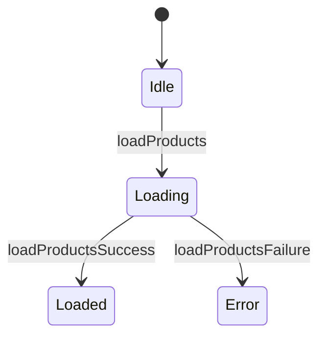

# 🔴 NgRx Practice Exercises

## Overview
Master Redux-style state management in Angular including store setup, actions, reducers, selectors, effects, and entity management.

---

## 📚 Basic Exercises (4)

### Exercise 1: Store Setup
**Objective**: Configure NgRx store in a standalone Angular application.
**Location**: `basic/exercise-1-store/`

**Key Concepts**:
- `provideStore({})` - Root store configuration
- `provideEffects([])` - Effects registration
- `provideStoreDevtools()` - Redux DevTools
- `isDevMode()` - Environment detection

---

### Exercise 2: Actions
**Objective**: Create type-safe actions with props using createAction.
**Location**: `basic/exercise-2-actions/`

**Key Concepts**:
```typescript
export const loadProducts = createAction('[Products] Load');
export const loadProductsSuccess = createAction(
  '[Products] Load Success',
  props<{ products: Product[] }>()
);
```

---

### Exercise 3: Reducers
**Objective**: Create pure reducer functions with createReducer and on.
**Location**: `basic/exercise-3-reducers/`

**State Flow**:


---

### Exercise 4: Selectors
**Objective**: Create memoized selectors with createSelector.
**Location**: `basic/exercise-4-selectors/`

**Key Concepts**:
```typescript
export const selectProductsState = createFeatureSelector<ProductsState>('products');
export const selectAllProducts = createSelector(selectProductsState, s => s.products);
export const selectProductById = (id: string) => createSelector(
  selectAllProducts, products => products.find(p => p.id === id)
);
```

---

## 🎯 Complex Scenarios (5)

### Scenario 1: Effects ⭐
**Objective**: Handle async operations with createEffect.
**Location**: `complex/scenario-1-effects/`

**Skills Tested**:
- Creating effects with createEffect
- Using flattening operators (switchMap, mergeMap)
- Error handling with catchError
- Non-dispatching effects

---

### Scenario 2: Entity Adapter ⭐⭐
**Objective**: Manage normalized entity collections with @ngrx/entity.
**Location**: `complex/scenario-2-entity/`

**Skills Tested**:
- Creating EntityAdapter
- Using adapter methods (addOne, updateOne, removeOne)
- Built-in selectors (selectAll, selectEntities)
- Extending EntityState

---

### Scenario 3: Effects with Retry ⭐⭐
**Objective**: Advanced effects with retry logic and error mapping.
**Location**: `complex/scenario-3-effects/`

**Skills Tested**:
- Exponential backoff retry
- Error message mapping
- Logging/analytics effects
- Multiple effect patterns

---

### Scenario 4: Shopping Cart ⭐⭐⭐ (INTERVIEW FAVORITE)
**Objective**: Complete shopping cart with derived selectors.
**Location**: `complex/scenario-4-shopping-cart/`

**Skills Tested**:
- Complex state management
- Composed selectors for derived values
- Immutable array updates
- ViewModel pattern
- LocalStorage sync

**This is the most common NgRx interview question!**

---

### Scenario 5: Feature State (Lazy Loading) ⭐⭐
**Objective**: Implement lazy-loaded feature state.
**Location**: `complex/scenario-5-feature-state/`

**Skills Tested**:
- provideState in route config
- Feature state vs root state
- OnInitEffects
- State lifecycle

---

## 🎓 Exercise Difficulty Key

| Symbol | Difficulty | Time Estimate |
|--------|------------|---------------|
| ⭐ | Basic | 15-30 min |
| ⭐⭐ | Intermediate | 30-60 min |
| ⭐⭐⭐ | Advanced | 60-90 min |

---

## 🔑 Key Takeaways

1. **Single source of truth**: All app state in one store
2. **Actions**: Describe events, not commands - use `[Source] Event` pattern
3. **Reducers**: Pure functions, immutable updates - never mutate!
4. **Selectors**: Memoized for performance - compose small selectors
5. **Effects**: Handle side effects outside reducers - always catch errors!

---

## 📖 Quick Reference

### Action Naming Convention
```typescript
'[Product List Page] Load Products'    // User-initiated
'[Products API] Load Products Success'  // API response
'[Products API] Load Products Failure'  // API error
```

### Reducer Immutability Patterns
```typescript
// Update item in array
items.map(item => item.id === id ? { ...item, name: 'New' } : item)

// Remove item from array
items.filter(item => item.id !== id)

// Add item to array
[...items, newItem]
```

### Selector Composition
```typescript
selectItems → selectSubtotal → selectTax → selectTotal
      ↓              ↓             ↓           ↓
    items    Σ(price×qty)   sub×rate    sub+tax
```

---

## 📚 Resources

- [NgRx Store Guide](https://ngrx.io/guide/store)
- [NgRx Effects](https://ngrx.io/guide/effects)
- [NgRx Entity](https://ngrx.io/guide/entity)
- [NgRx Best Practices](https://ngrx.io/guide/store/best-practices)
