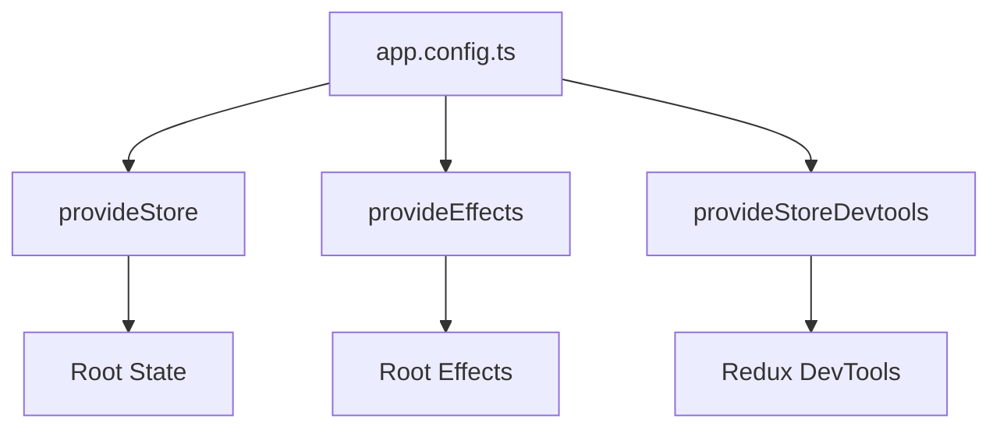
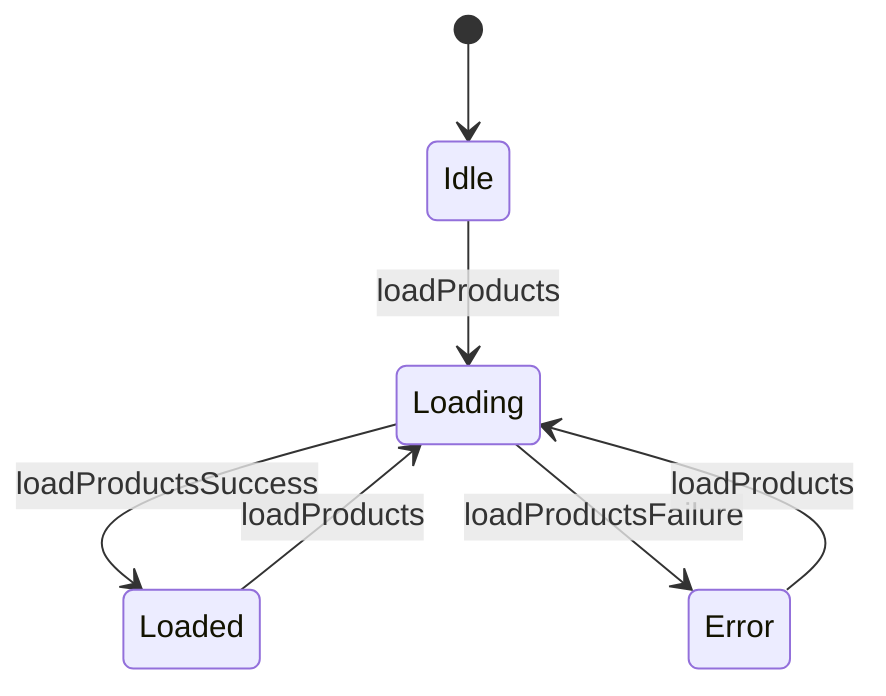

# 🔴 NgRx Practice Exercises

## Overview
Master Redux-style state management in Angular including store setup, actions, reducers, selectors, effects, and entity management.

---

## 📚 Basic Exercises (4)

### Exercise 1: Store Setup
**Objective**: Configure NgRx store in a standalone Angular application.

#### Problem Statement
Set up NgRx store with root state, StoreDevtools for debugging, and Effects for side effects in an Angular 17+ standalone app.

#### Requirements
- Install @ngrx/store, @ngrx/effects, @ngrx/store-devtools
- Configure providers in app.config.ts
- Create initial app state interface
- Enable DevTools only in development mode

#### Solution Flow


#### Key Concepts
```typescript
export const appConfig: ApplicationConfig = {
  providers: [
    provideStore({}),
    provideEffects([]),
    provideStoreDevtools({ maxAge: 25, logOnly: !isDevMode() })
  ]
};
```

---

### Exercise 2: Actions
**Objective**: Create type-safe actions with props using createAction.

#### Problem Statement
Define a set of actions for a products feature including load, success, failure, and CRUD operations.

#### Requirements
- Use createAction from @ngrx/store
- Define action with no payload
- Define action with single prop
- Group related actions in a namespace

#### Key Concepts
```typescript
export const loadProducts = createAction('[Products] Load');
export const loadProductsSuccess = createAction(
  '[Products] Load Success',
  props<{ products: Product[] }>()
);
export const loadProductsFailure = createAction(
  '[Products] Load Failure',
  props<{ error: string }>()
);
```

---

### Exercise 3: Reducers
**Objective**: Create pure reducer functions with createReducer and on.

#### Problem Statement
Implement a reducer that handles loading state, data storage, and error handling for a products feature.

#### Requirements
- Use createReducer and on functions
- Handle loading, success, and failure states
- Maintain immutability
- Define initial state interface

#### Solution Flow


---

### Exercise 4: Selectors
**Objective**: Create memoized selectors with createSelector.

#### Problem Statement
Build composable selectors to efficiently query and derive state in a products feature.

#### Requirements
- Use createFeatureSelector
- Use createSelector for composed selectors
- Implement filtering selector
- Implement aggregation selector

#### Key Concepts
```typescript
export const selectProductsState = createFeatureSelector<ProductsState>('products');
export const selectAllProducts = createSelector(selectProductsState, s => s.products);
export const selectLoading = createSelector(selectProductsState, s => s.loading);
export const selectProductById = (id: string) => createSelector(
  selectAllProducts,
  products => products.find(p => p.id === id)
);
```

---

## 🎯 Complex Scenarios (5)

### Scenario 1: Effects
**Objective**: Handle async operations with createEffect.

#### Use Case
Fetch products from an API when loadProducts action is dispatched, handling success and error cases.

#### Key Concepts
```typescript
loadProducts$ = createEffect(() =>
  this.actions$.pipe(
    ofType(loadProducts),
    switchMap(() => this.api.getProducts().pipe(
      map(products => loadProductsSuccess({ products })),
      catchError(error => of(loadProductsFailure({ error: error.message })))
    ))
  )
);
```

---

### Scenario 2: Entity Adapter
**Objective**: Manage normalized entity collections with @ngrx/entity.

#### Use Case
Optimize CRUD operations for large product collections with efficient lookups.

---

### Scenario 3: Feature State
**Objective**: Lazy-load feature state with provideState.

#### Use Case
Load products state only when navigating to products route.

---

### Scenario 4: Router Store
**Objective**: Sync router state with NgRx store.

#### Use Case
Access route params from selectors for data fetching.

---

### Scenario 5: Component Store
**Objective**: Use @ngrx/component-store for local component state.

#### Use Case
Manage complex form state that doesn't need global access.

---

## 🔑 Key Takeaways
1. **Single source of truth**: All app state in one store
2. **Actions**: Describe events, not commands
3. **Reducers**: Pure functions, immutable updates
4. **Selectors**: Memoized for performance
5. **Effects**: Handle side effects outside reducers

## 📖 Resources
- [NgRx Store Guide](https://ngrx.io/guide/store)
- [NgRx Effects](https://ngrx.io/guide/effects)
- [NgRx Best Practices](https://ngrx.io/guide/store/best-practices)
