# Solution: Custom Pipe

## 📊 Flow Diagram

```mermaid
flowchart TD
    subgraph Pipe["🔧 Truncate Pipe"]
        A[Input Text] --> B{Length Check}
        B -->|Shorter| C[Return As-Is]
        B -->|Longer| D[Slice to Length]
        D --> E[Add Suffix]
        E --> F[Return Truncated]
    end

    style C fill:#dcfce7
    style F fill:#dcfce7
```



## 💻 Implementation

```typescript
import { Pipe, PipeTransform } from '@angular/core';

@Pipe({
  name: 'truncate',
  standalone: true
})
export class TruncatePipe implements PipeTransform {
  transform(
    value: string | null | undefined,
    length: number = 50,
    suffix: string = '...'
  ): string {
    if (!value) return '';
    if (value.length <= length) return value;
    
    return value.slice(0, length).trim() + suffix;
  }
}
```

### Usage

```html
{{ longText | truncate }}
{{ longText | truncate:25 }}
{{ longText | truncate:100:'...' }}
```

## 🔑 Key Concepts

- **@Pipe**: Decorator to define a pipe
- **PipeTransform**: Interface requiring transform method
- **standalone: true**: Modern Angular standalone pipe
- **Pure by default**: Only recalculates on input change
