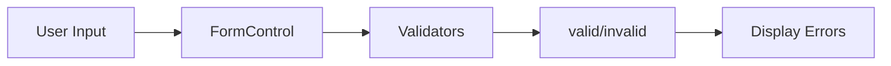

# 🟦 Exercise 1: FormControl - Solution

## 📊 Control Flow



## 📝 Implementation

```typescript
import { Component } from '@angular/core';
import { FormControl, Validators, ReactiveFormsModule } from '@angular/forms';

@Component({
  selector: 'app-formcontrol-exercise',
  standalone: true,
  imports: [ReactiveFormsModule],
  template: `
    <div class="form-group">
      <label>Username:</label>
      <input [formControl]="username" placeholder="Enter username">
      
      @if (username.invalid && username.touched) {
        <div class="errors">
          @if (username.errors?.['required']) {
            <p>⚠️ Username is required</p>
          }
          @if (username.errors?.['minlength']) {
            <p>⚠️ Minimum {{ username.errors?.['minlength'].requiredLength }} characters</p>
          }
        </div>
      }
      
      <div class="state">
        <p>Valid: {{ username.valid }}</p>
        <p>Touched: {{ username.touched }}</p>
        <p>Value: {{ username.value }}</p>
      </div>
    </div>
  `
})
export class FormControlExerciseComponent {
  username = new FormControl('', [
    Validators.required,
    Validators.minLength(3)
  ]);
}
```

## 🔑 Key Concepts

| Property | Description |
|----------|-------------|
| `value` | Current value |
| `valid` | True if all validators pass |
| `invalid` | True if any validator fails |
| `errors` | Object with validation errors |
| `touched` | True if control has been focused |
| `dirty` | True if value has changed |
