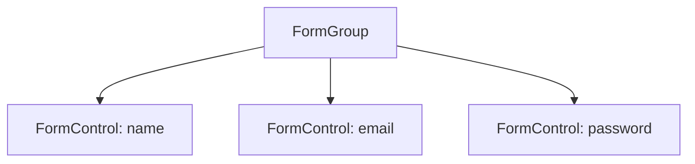

# 🟦 Exercise 2: FormGroup - Solution



```typescript
form = new FormGroup({
  name: new FormControl('', Validators.required),
  email: new FormControl('', [Validators.required, Validators.email]),
  password: new FormControl('', [Validators.required, Validators.minLength(8)])
});

onSubmit(): void {
  if (this.form.valid) {
    console.log(this.form.value);
    // { name: '...', email: '...', password: '...' }
  }
}
```

```html
<form [formGroup]="form" (ngSubmit)="onSubmit()">
  <input formControlName="name" placeholder="Name">
  <input formControlName="email" placeholder="Email">
  <input formControlName="password" type="password" placeholder="Password">
  <button type="submit" [disabled]="form.invalid">Submit</button>
</form>
```
