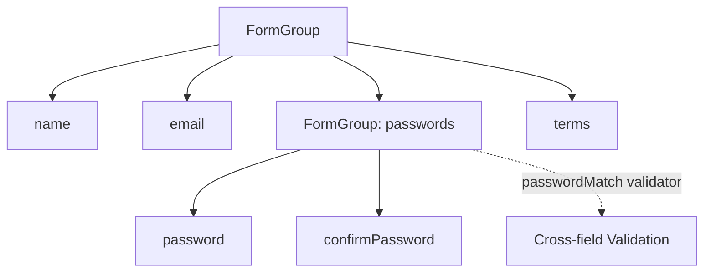

# 🟥 Scenario 1: Registration Form - Solution



```typescript
function passwordMatchValidator(group: AbstractControl): ValidationErrors | null {
  const password = group.get('password')?.value;
  const confirm = group.get('confirmPassword')?.value;
  return password === confirm ? null : { passwordMismatch: true };
}

registrationForm = new FormGroup({
  name: new FormControl('', [Validators.required, Validators.minLength(2)]),
  email: new FormControl('', [Validators.required, Validators.email]),
  passwords: new FormGroup({
    password: new FormControl('', [Validators.required, Validators.minLength(8)]),
    confirmPassword: new FormControl('', Validators.required)
  }, { validators: passwordMatchValidator }),
  terms: new FormControl(false, Validators.requiredTrue)
});

onSubmit(): void {
  if (this.registrationForm.valid) {
    const { name, email, passwords } = this.registrationForm.value;
    console.log({ name, email, password: passwords?.password });
  }
}
```
