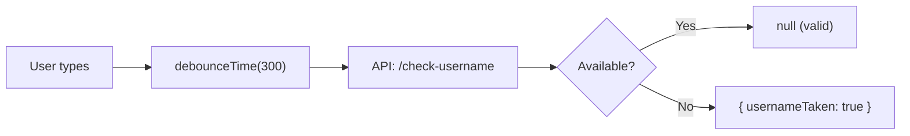

# 🟥 Scenario 4: Async Validators - Solution



```typescript
import { AsyncValidatorFn } from '@angular/forms';
import { map, catchError, debounceTime, switchMap, first } from 'rxjs/operators';

function usernameAvailableValidator(http: HttpClient): AsyncValidatorFn {
  return (control: AbstractControl) => {
    return timer(300).pipe(  // Debounce
      switchMap(() => 
        http.get<{available: boolean}>(`/api/check-username/${control.value}`)
      ),
      map(response => response.available ? null : { usernameTaken: true }),
      catchError(() => of(null))  // On error, consider valid
    );
  };
}

// Usage
username = new FormControl('', 
  [Validators.required],  // Sync validators
  [usernameAvailableValidator(this.http)]  // Async validators
);
```

```html
<input [formControl]="username">
@if (username.pending) {
  <span>Checking availability...</span>
}
@if (username.errors?.['usernameTaken']) {
  <span class="error">Username is already taken</span>
}
```
