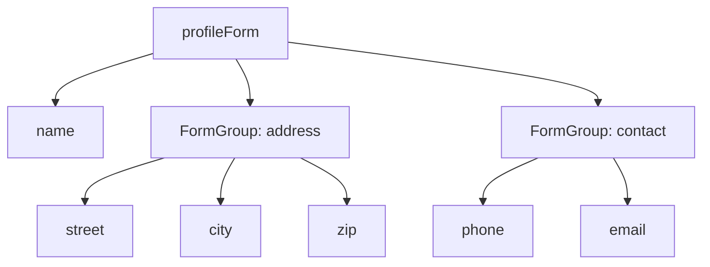

# 🟥 Scenario 5: Nested FormGroups - Solution



```typescript
profileForm = new FormGroup({
  name: new FormControl('', Validators.required),
  
  address: new FormGroup({
    street: new FormControl(''),
    city: new FormControl('', Validators.required),
    zip: new FormControl('', [Validators.required, Validators.pattern(/^\d{5}$/)])
  }),
  
  contact: new FormGroup({
    phone: new FormControl(''),
    email: new FormControl('', Validators.email)
  })
});

// Access nested value
get city() {
  return this.profileForm.get('address.city');
}
```

```html
<form [formGroup]="profileForm">
  <input formControlName="name" placeholder="Name">
  
  <div formGroupName="address">
    <input formControlName="street" placeholder="Street">
    <input formControlName="city" placeholder="City">
    <input formControlName="zip" placeholder="ZIP">
  </div>
  
  <div formGroupName="contact">
    <input formControlName="phone" placeholder="Phone">
    <input formControlName="email" placeholder="Email">
  </div>
</form>
```
