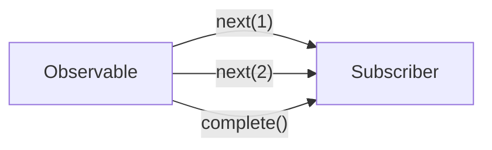

# 🟦 Exercise 1: Observables - Solution



```typescript
import { Observable } from 'rxjs';

const numbers$ = new Observable<number>(subscriber => {
  subscriber.next(1);
  subscriber.next(2);
  subscriber.next(3);
  subscriber.complete();
});

// Subscribe
const subscription = numbers$.subscribe({
  next: value => console.log('Value:', value),
  error: err => console.error('Error:', err),
  complete: () => console.log('Complete!')
});

// Don't forget to unsubscribe!
ngOnDestroy() {
  subscription.unsubscribe();
}
```

## Key Concepts
- Observable = lazy push collection
- subscribe() starts the stream
- unsubscribe() prevents memory leaks
