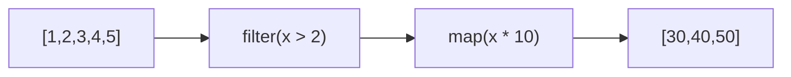

# 🟦 Exercise 2: Operators - Solution



```typescript
import { of } from 'rxjs';
import { map, filter } from 'rxjs/operators';

of(1, 2, 3, 4, 5).pipe(
  filter(x => x > 2),      // [3, 4, 5]
  map(x => x * 10)         // [30, 40, 50]
).subscribe(console.log);
```
