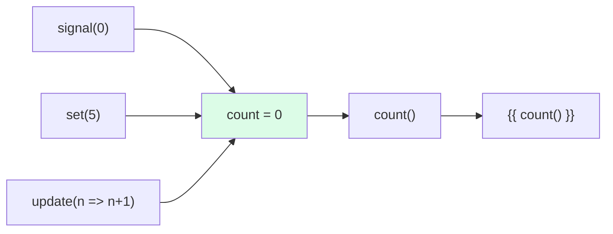

# 🟦 Exercise 1: Creating Signals - Solution

## 📊 Signal Flow



## 📝 Implementation

```typescript
import { Component, signal } from '@angular/core';

@Component({
  template: `
    <p>Counter: {{ count() }}</p>
    <button (click)="increment()">+</button>
    <button (click)="decrement()">-</button>
    <button (click)="reset()">Reset</button>
  `
})
export class CounterComponent {
  // Create a signal with initial value 0
  count = signal(0);
  
  increment(): void {
    // update() receives current value, returns new value
    this.count.update(n => n + 1);
  }
  
  decrement(): void {
    this.count.update(n => n - 1);
  }
  
  reset(): void {
    // set() replaces the entire value
    this.count.set(0);
  }
}
```

## 🔑 Key Concepts

| Method | Usage | Example |
|--------|-------|---------|
| `signal()` | Create | `count = signal(0)` |
| `()` | Read | `this.count()` |
| `set()` | Replace | `this.count.set(5)` |
| `update()` | Transform | `this.count.update(n => n + 1)` |
