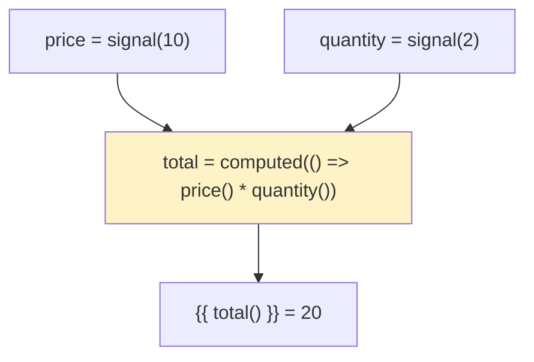

# 🟦 Exercise 2: Computed Signals - Solution

## 📊 Reactive Graph



## 📝 Implementation

```typescript
import { Component, signal, computed } from '@angular/core';

@Component({
  template: `
    <div>
      <label>Price: ${{ price() }}</label>
      <input type="range" [value]="price()" (input)="price.set(+$any($event.target).value)">
    </div>
    <div>
      <label>Quantity: {{ quantity() }}</label>
      <input type="range" [value]="quantity()" (input)="quantity.set(+$any($event.target).value)">
    </div>
    <p><strong>Total: ${{ total() }}</strong></p>
  `
})
export class CartComponent {
  price = signal(10);
  quantity = signal(2);
  
  // Computed automatically recalculates when dependencies change
  total = computed(() => this.price() * this.quantity());
}
```

## 🔑 Key Points

- `computed()` creates a derived read-only signal
- Automatically tracks dependencies (signals read inside)
- Only recalculates when dependencies change (memoized)
- Cannot call `set()` or `update()` on computed signals
