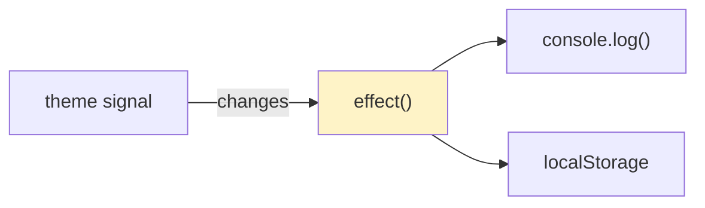

# 🟦 Exercise 3: Effects - Solution

## 📊 Effect Flow



## 📝 Implementation

```typescript
import { Component, signal, effect } from '@angular/core';

@Component({
  template: `
    <p>Theme: {{ theme() }}</p>
    <button (click)="toggleTheme()">Toggle Theme</button>
  `
})
export class ThemeComponent {
  theme = signal<'light' | 'dark'>(
    (localStorage.getItem('theme') as 'light' | 'dark') || 'light'
  );
  
  constructor() {
    // Effect runs whenever theme() changes
    effect(() => {
      const currentTheme = this.theme();
      console.log('Theme changed to:', currentTheme);
      localStorage.setItem('theme', currentTheme);
      document.body.className = currentTheme;
    });
  }
  
  toggleTheme(): void {
    this.theme.update(t => t === 'light' ? 'dark' : 'light');
  }
}
```

## ⚠️ Important Notes

- Effects run at least once initially
- Effect cleanup: return a cleanup function
- Don't create effects in loops
- Use `untracked()` to read signals without tracking
