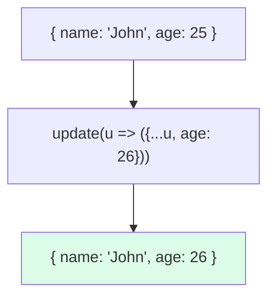

# 🟦 Exercise 4: Signal Updates - Solution

## 📊 Immutable Update Pattern



## 📝 Implementation

```typescript
@Component({
  template: `
    <p>{{ user().name }}, {{ user().age }} years old</p>
    <button (click)="birthday()">🎂 Birthday</button>
    
    <p>Items: {{ items().length }}</p>
    <button (click)="addItem()">Add</button>
  `
})
export class UpdatesComponent {
  user = signal({ name: 'John', age: 25 });
  items = signal<string[]>(['Apple', 'Banana']);
  
  birthday(): void {
    // Spread to create new object
    this.user.update(u => ({ ...u, age: u.age + 1 }));
  }
  
  addItem(): void {
    // Spread to create new array
    this.items.update(arr => [...arr, 'New Item']);
  }
  
  removeItem(index: number): void {
    this.items.update(arr => arr.filter((_, i) => i !== index));
  }
}
```

## ⚠️ Common Mistake

```typescript
// ❌ WRONG - mutating the object
this.user.update(u => {
  u.age++;  // Mutation!
  return u; // Same reference - no change detected
});

// ✅ CORRECT - new object
this.user.update(u => ({ ...u, age: u.age + 1 }));
```
