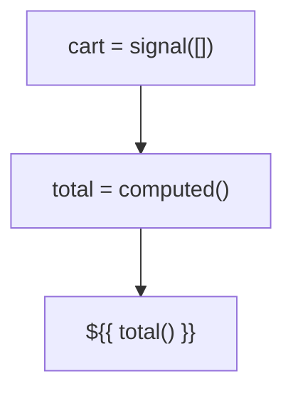

# 🟥 Scenario 1: Shopping Cart - Solution



```typescript
cart = signal<CartItem[]>([]);
total = computed(() => 
  this.cart().reduce((sum, item) => sum + item.price * item.qty, 0)
);

addToCart(product: Product): void {
  this.cart.update(items => [...items, { ...product, qty: 1 }]);
}
```
