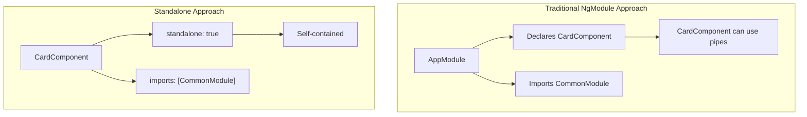
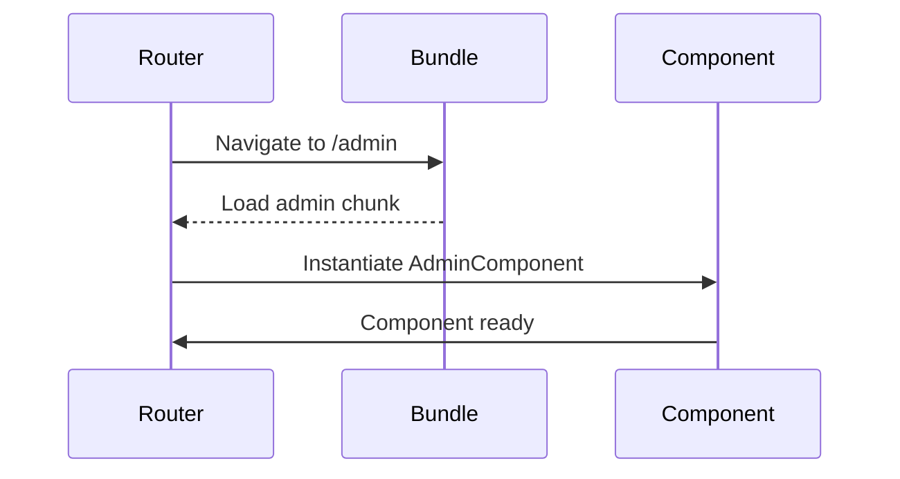
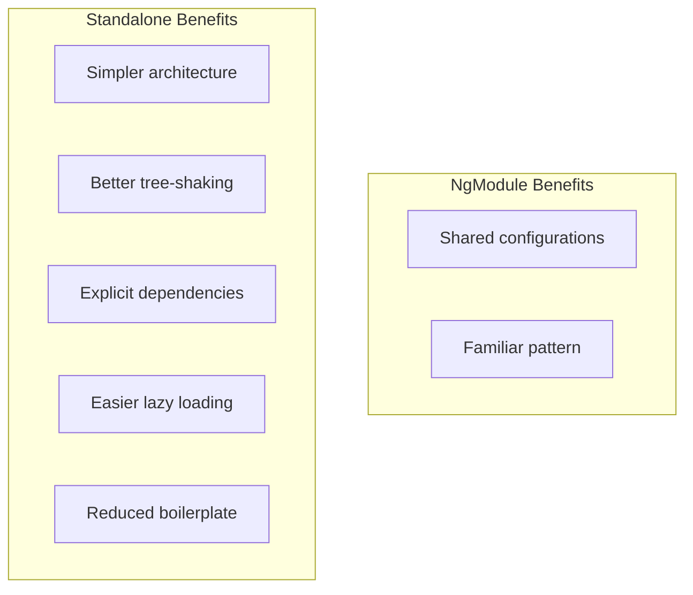

# 🧩 Standalone Components Practice Exercises

## Overview
Master Angular's modern standalone component architecture, including component creation, imports management, providers configuration, and migration from NgModule-based applications.

---

## 📚 Basic Exercises (4)

### Exercise 1: Creating Standalone Components
**Objective**: Create your first standalone component without NgModules.

#### Problem Statement
Build a simple card component that is fully standalone and can be used anywhere without module declaration.

#### Key Concept
```typescript
@Component({
  selector: 'app-card',
  standalone: true,  // 👈 This makes it standalone
  imports: [CommonModule],  // 👈 Declare dependencies directly
  template: `
    <div class="card">
      <ng-content></ng-content>
    </div>
  `
})
export class CardComponent {}
```

#### Architecture Comparison


---

### Exercise 2: Standalone Component Imports
**Objective**: Manage imports in standalone components for pipes, directives, and other components.

#### Problem Statement
Create a product list component that uses various Angular features (pipes, directives, child components).

#### Requirements
- Import CommonModule for *ngFor, *ngIf
- Import custom pipes
- Import child standalone components
- Import directive

#### Pattern
```typescript
@Component({
  standalone: true,
  imports: [
    CommonModule,           // Built-in directives/pipes
    ProductCardComponent,   // Child standalone component
    CurrencyPipe,          // Custom pipe
    HighlightDirective     // Custom directive
  ],
  template: `...`
})
export class ProductListComponent {}
```

---

### Exercise 3: Standalone Component Providers
**Objective**: Configure dependency injection in standalone components.

#### Problem Statement
Create a feature component with its own scoped service provider.

#### Requirements
- Provide service at component level
- Understand provider scope
- Use injection tokens

#### Key Concepts
```typescript
@Component({
  standalone: true,
  providers: [
    ProductService,  // Scoped to this component
    { provide: API_URL, useValue: '/api/products' }
  ],
  template: `...`
})
export class ProductFeatureComponent {
  constructor(private productService: ProductService) {
    // Gets its own instance of ProductService
  }
}
```

---

### Exercise 4: Bootstrapping Standalone Application
**Objective**: Bootstrap an Angular application without AppModule.

#### Problem Statement
Create a fully standalone application from scratch.

#### Application Bootstrap
```typescript
// main.ts - No AppModule needed!
import { bootstrapApplication } from '@angular/platform-browser';
import { AppComponent } from './app/app.component';
import { appConfig } from './app/app.config';

bootstrapApplication(AppComponent, appConfig)
  .catch(err => console.error(err));
```

#### App Configuration
```typescript
// app.config.ts
export const appConfig: ApplicationConfig = {
  providers: [
    provideRouter(routes),
    provideHttpClient(),
    provideAnimations()
  ]
};
```

---

## 🎯 Complex Scenarios (5)

### Scenario 1: Lazy Loading Standalone Components
**Objective**: Implement lazy loading for standalone components in routing.

#### Use Case
Application with feature modules replaced by lazy-loaded standalone components.

#### Implementation
```typescript
export const routes: Routes = [
  {
    path: 'admin',
    loadComponent: () => import('./admin/admin.component')
      .then(m => m.AdminComponent)
  },
  {
    path: 'products',
    loadChildren: () => import('./products/product.routes')
      .then(m => m.PRODUCT_ROUTES)
  }
];
```

#### Lazy Loading Flow


---

### Scenario 2: Migrating from NgModules
**Objective**: Convert an existing NgModule-based feature to standalone.

#### Migration Steps
1. Add `standalone: true` to components
2. Move imports from NgModule to component
3. Update routing to use `loadComponent`
4. Remove NgModule when empty

#### Before/After
```mermaid
graph LR
    subgraph "Before: NgModule"
        A[ProductModule] --> B[ProductListComponent]
        A --> C[ProductDetailComponent]
        A --> D[imports: CommonModule]
    end
    
    subgraph "After: Standalone"
        E[ProductListComponent<br>standalone: true<br>imports: [...]]
        F[ProductDetailComponent<br>standalone: true<br>imports: [...]]
    end
    
    A -.->|migrate| E
    A -.->|migrate| F
```

---

### Scenario 3: Shared Standalone Library
**Objective**: Create a library of reusable standalone components.

#### Use Case
Design system with standalone button, input, modal, and card components.

```typescript
// Shared standalone components
export { ButtonComponent } from './button/button.component';
export { InputComponent } from './input/input.component';
export { ModalComponent } from './modal/modal.component';
export { CardComponent } from './card/card.component';

// Consumer just imports what they need
@Component({
  standalone: true,
  imports: [ButtonComponent, CardComponent]
})
```

---

### Scenario 4: Environment Providers
**Objective**: Configure application-wide providers for standalone apps.

#### Use Case
Configure HTTP interceptors, error handlers, and logging in a standalone app.

```typescript
export const appConfig: ApplicationConfig = {
  providers: [
    provideRouter(routes, withPreloading(PreloadAllModules)),
    provideHttpClient(
      withInterceptors([authInterceptor, loggingInterceptor])
    ),
    provideAnimations(),
    {
      provide: ErrorHandler,
      useClass: GlobalErrorHandler
    }
  ]
};
```

---

### Scenario 5: Testing Standalone Components
**Objective**: Write unit tests for standalone components.

#### Testing Setup
```typescript
describe('ProductListComponent', () => {
  beforeEach(async () => {
    await TestBed.configureTestingModule({
      imports: [ProductListComponent],  // Import, don't declare!
      providers: [
        { provide: ProductService, useClass: MockProductService }
      ]
    }).compileComponents();
  });

  it('should display products', () => {
    const fixture = TestBed.createComponent(ProductListComponent);
    fixture.detectChanges();
    expect(fixture.nativeElement.querySelectorAll('.product').length).toBe(3);
  });
});
```

---

## 🔑 Key Takeaways

1. **Self-Contained**: Components declare their own dependencies
2. **Tree-Shakable**: Unused code is eliminated at build time
3. **Simplified Mental Model**: No module boundaries to manage
4. **Lazy Loading**: Direct component loading without wrapper modules
5. **Provider Scope**: Control DI scope at component level
6. **Interoperability**: Works with existing NgModule-based code

## 📊 Comparison Chart


## 🔄 Migration Schematic
```bash
# Automatic migration
ng generate @angular/core:standalone
```

## 📖 Resources
- [Standalone Components Guide](https://angular.io/guide/standalone-components)
- [Migrating to Standalone](https://angular.io/guide/standalone-migration)
- [Application Bootstrap](https://angular.io/guide/standalone-components#configuring-dependency-injection)
